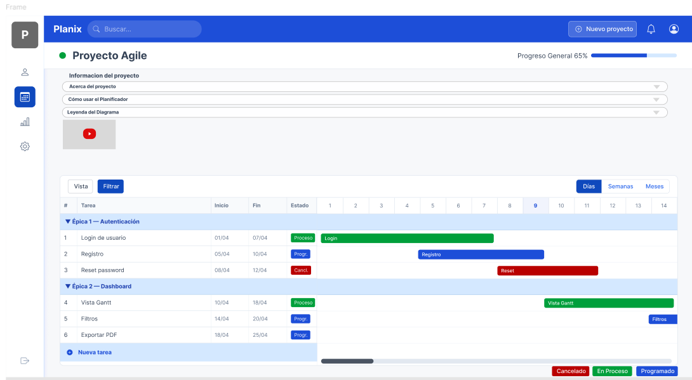

# Planificador de Tareas - Diagrama de Gantt

## Datos Académicos

- **Carrera:** Tecnicatura Universitaria en Programación de Sistemas
- **Materia:** Programación Web I - 1º Cuat. 2026
- **Docente:** Matias Velasquez

## Integrantes del equipo

| Nombre y Apellido    | Matrícula |    Usuario Git    |                  Rol                  |
| :------------------- | :-------: | :---------------: | :-----------------------------------: |
| Martín Debenedetti   |  151579   | martindebenedetti | Arquitecto de Diagrama de Actividades |
| Leandro Berro        |  155667   |      leanlex      |       Desarrollador JavaScript        |
| Gian Franco Pasquali |  148159   |      giann98      |         Coordinador / DevOps          |
| Compartido           |     -     |         -         |    Tester JavaScript / QA Engineer    |

---

## Descripción del proyecto

Este proyecto propone el desarrollo de una página web orientada a la visualización y planificación de tareas mediante un esquema tipo **diagrama de Gantt**.

El sistema busca representar de forma clara la organización de tareas, sus fechas, duración, relaciones, responsables y nivel de avance. A partir de las bases construidas en las Actividades Obligatorias 1 y 2, el **Primer Parcial** y la Actividad Obligatoria 3, esta etapa incorpora una nueva evolución del proyecto centrada en:

- la **migración visual y estructural a Bootstrap**;
- la mejora de la **responsividad** del sitio;
- la incorporación de **componentes avanzados de Bootstrap**;
- la incorporación de **componentes HTML avanzados**;
- la continuidad del trabajo colaborativo mediante GitHub, issues, Pull Requests, changelog y documentación técnica.

---

## Objetivos

- Consolidar una base visual y funcional para un planificador de tareas tipo diagrama de Gantt.
- Mantener coherencia entre diseño, estructura HTML, estilos CSS y futura integración con Bootstrap.
- Mejorar la experiencia responsive del proyecto en distintos dispositivos.
- Incorporar componentes visuales y estructurales más avanzados para enriquecer la interfaz.
- Documentar técnica y metodológicamente el trabajo del equipo mediante specs, testing y changelog.
- Dejar preparada una base sólida para próximas etapas de desarrollo con JavaScript e interactividad.

---

## Tecnologías utilizadas

- HTML5
- CSS3
- Bootstrap 5
- Markdown
- Git y GitHub
- GitHub Copilot
- Figma
- Playwright MCP
- GitHub MCP
- Claude Code MCP
- JavaScript
- Jasmine
- PlantUML

---

## Funcionalidades previstas

- Visualización de tareas en formato tabla.
- Representación gráfica de tareas en una línea de tiempo tipo Gantt.
- Visualización de duración, fechas de inicio y fin.
- Visualización de relaciones entre tareas.
- Visualización del porcentaje de avance.
- Mejora de la navegación principal mediante componentes reutilizables.
- Mejora de la experiencia responsive utilizando Bootstrap.
- Incorporación de componentes avanzados de Bootstrap.
- Incorporación de componentes HTML avanzados.
- Posibilidad de ampliar el detalle de cada tarea mediante una ventana modal o vista ampliada.
- Integración progresiva de lógica JavaScript para simulación funcional del sistema.
- Base preparada para futura integración con DOM y eventos en próximas entregas.

---

## Estructura general prevista de la página

La página contempla una organización visual compuesta por:

- barra de navegación superior;
- panel lateral o área de navegación contextual;
- encabezado de proyecto con estado y progreso;
- sector de carga o edición de tareas;
- área principal destinada a la visualización del cronograma;
- componentes complementarios para interacción y visualización;
- pie de página con referencias e información general.

---

## Documentación

### Mockup del proyecto en Figma

- **Enlace al archivo de Figma:** [Ver mockup en Figma](https://www.figma.com/design/v1QKUD77dcsM0WDRMHapz6/Mockup-UX---Planificador-Gantt?node-id=54-283&t=Ww4homzl6jfJxrQm-0)

### Mockup inicial (Actividad Obligatoria 1)


### Mockup con estilos (Actividad Obligatoria 2)

En esta etapa se incorporaron al diseño:

- paleta de colores definitiva;
- tipografías del sistema;
- espaciados y dimensiones de componentes;
- estados de interacción de los elementos de interfaz.


### Mockup actualizado para Bootstrap (Primer Parcial)

Para el Primer Parcial se generó una nueva versión del mockup tomando como base el diseño mejorado de la Actividad Obligatoria 2 e incorporando criterios visuales compatibles con Bootstrap, incluyendo:

- una **navbar** superior;
- reorganización del layout con lógica de **grilla Bootstrap**;
- mantenimiento de la identidad visual del proyecto;
- una estructura visual preparada para integrar componentes avanzados.



### Diagramas de Actividades — 4 flujos funcionales

[Ver documentación de diagramas de actividades](docs/05-diagramas/01-diagrama-de-actividades/diagramas-doc.md)

Los diagramas cubren los siguientes flujos del sistema:

- **Flujo 1:** Crear Proyecto
- **Flujo 2:** Agregar Tarea a un Proyecto
- **Flujo 3:** Calcular Avance del Proyecto
- **Flujo 4:** Listar y Filtrar Tareas

### Índice de testing y casos de prueba

[Ver documentación de testing](docs/04-testing/testing-doc.md)

---

## Estado del proyecto

El proyecto se encuentra en la etapa de cierre y publicación de la **Actividad Obligatoria N.º 4**, tomando como base consolidada las actividades anteriores y la tercera entrega.

En esta etapa se incorporaron clases de dominio orientadas a objetos, persistencia mediante Web Storage, manejo de Eventos + DOM y testing automatizado con Jasmine.

### Avances alcanzados

-  implementación de las clases `Tarea`, `Proyecto` y `GestorProyectos`;
-  incorporación de validaciones dentro de los modelos;
-  implementación de serialización y reconstrucción mediante `toJSON()` y `fromJSON()`;
-  persistencia de proyectos y tareas mediante `localStorage`;
-  persistencia del filtro activo mediante `sessionStorage`;
-  implementación de operaciones reutilizables en `StorageUtil`;
-  refactorización de `js/script.js` como controlador de Eventos + DOM;
-  reemplazo de `prompt()` y `alert()` por formularios y alertas visuales de Bootstrap;
-  validación de formularios en tiempo real;
-  actualización dinámica del selector de proyectos;
-  renderizado de tareas y estados en la tabla;
-  actualización de la barra de avance;
-  filtrado de tareas por estado;
-  revisión técnica de las PR #108, #113 y #116;
-  registro y seguimiento de los Issues #114 y #115;
-  implementación de tests Jasmine para POO, Storage y Eventos + DOM;
-  actualización de `test-runner.html` con un DOM mínimo para testing;
-  incorporación de evidencias visuales de las ejecuciones;
-  documentación técnica de los roles mediante specs;
-  integración progresiva de las ramas técnicas hacia `develop`.

### Resultado final de testing

```text
88 specs, 0 failures
```

-  88 tests ejecutados;
-  88 tests aprobados;
-  sin errores de carga;
-  sin regresiones detectadas en POO, Storage ni Eventos + DOM.

### Pendiente para la publicación final

- validación final de la rama `release/cuarta-entrega`;
- apertura y aprobación de la Pull Request hacia `master`;
- verificación de GitHub Pages sobre la versión integrada;
- creación del tag `v1.2-cuarta-entrega`;
- publicación de la GitHub Release;
- sincronización final de `master` hacia `develop`;
- limpieza controlada de ramas ya integradas.

---

## Organización del repositorio

-  `plan.md`: requerimientos funcionales y contexto general del proyecto.
-  `README.md`: presentación, objetivos, tecnologías y estado del proyecto.
-  `index.html`: estructura principal de la interfaz.
-  `css/styles.css`: variables, tipografías y layout general.
-  `css/components.css`: estilos de componentes visuales.
-  `css/responsive.css`: media queries y ajustes responsivos.
-  `css/bootstrap-overrides.css`: personalizaciones sobre Bootstrap.
-  `docs/01-mockup/`: imágenes y recursos visuales.
-  `docs/03-specs/`: especificaciones técnicas organizadas por actividad y rol.
-  `docs/03-specs/actividad-obligatoria-4/`: specs correspondientes a la Actividad Obligatoria N.º 4.
-  `docs/04-testing/`: documentación y casos de prueba.
-  `docs/05-diagramas/`: diagramas UML y archivos PlantUML.
-  `changelog.md`: registro de contribuciones, PR, fixes y participación.
-  `.github/PULL_REQUEST_TEMPLATE/`: plantillas para Pull Requests.
-  `js/models/Tarea.js`: clase de dominio para las tareas.
-  `js/models/Proyecto.js`: clase de dominio para proyectos y sus tareas.
-  `js/models/GestorProyectos.js`: administración de la colección de proyectos.
-  `js/utils/storage.js`: operaciones de persistencia con Web Storage.
-  `js/script.js`: controlador de Eventos + DOM.
-  `js/test/test-runner.html`: runner de Jasmine con DOM de prueba.
-  `js/test/models.spec.js`: tests de las clases del dominio.
-  `js/test/storage.spec.js`: tests de `localStorage`, `sessionStorage` y `StorageUtil`.
-  `js/test/script.spec.js`: tests de formularios, eventos y manipulación del DOM.
-  `js/test/screenshots/`: evidencias visuales de las ejecuciones de Jasmine.
-  `js/test/testing-doc.md`: documentación técnica del testing.


---

## Observaciones de trabajo colaborativo

El desarrollo del proyecto se organiza mediante:

- ramas `feature/` individuales por rol;
- Pull Requests hacia `develop`;
- revisión previa antes de cada merge;
- documentación obligatoria en `changelog.md`;
- uso de issues para seguimiento de tareas y bugs;
- coordinación de integración y release por parte del rol Coordinador / DevOps;
- uso de GitHub Copilot Agent y herramientas MCP como apoyo de desarrollo y testing.

---
