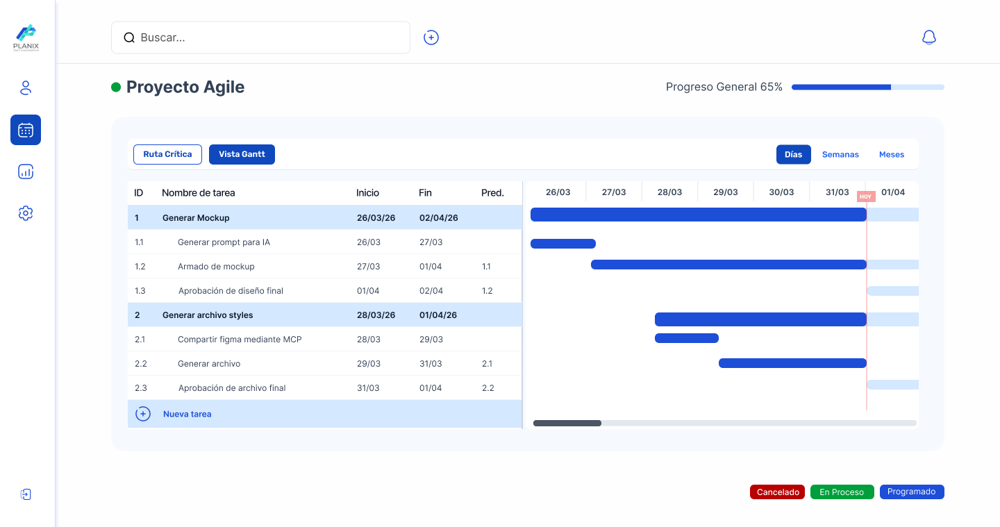

# Planificador de Tareas - Diagrama de Gantt

## Datos Académicos 
- **Carrera:** Tecnicatura Universitaria en Programación de Sistemas
- **Materia:** Programación Web I - 1º Cuat. 2026
- **Docente:** Matias Velasquez

## Integrantes del equipo

| Nombre y Apellido | Matricula | Usuario Git | Rol | 
|:---|:---:|:---:|:---:|
| Martín Debenedetti | 151579 | martindebenedetti | Desarrollador Frontend/CSS / Especialista en Responsive Design | 
| Leandro Berro | 155667 | leanlex | Documentador / QA Tester  |
| Gian Franco Pasquali | 148159 | giann98 | Coordinador / DevOps  |

## Descripción del proyecto
Este proyecto propone el desarrollo de una página web base orientada a la visualización y planificación de tareas mediante un esquema tipo diagrama de Gantt. La idea es representar de forma clara la organización de tareas, sus fechas, duración, relaciones y nivel de avance, estableciendo una referencia inicial que podrá evolucionar en futuras etapas con HTML, CSS e interactividad en JavaScript.

## Objetivos
- Definir una base conceptual y visual para un planificador de tareas tipo diagrama de Gantt.
- Organizar la información principal de manera clara y comprensible para el usuario.
- Documentar el proyecto y su estructura inicial mediante archivos de apoyo.
- Establecer una referencia de diseño que sirva de guía para futuras etapas de desarrollo frontend.
- Dejar planteadas funcionalidades que podrán implementarse posteriormente con HTML, CSS y JavaScript.

## Tecnologías utilizadas
- HTML5
- Markdown
- Git y GitHub
- GitHub Copilot
- Figma

## Funcionalidades previstas
- Visualización de tareas en formato tabla.
- Representación gráfica de tareas en una línea de tiempo.
- Visualización de duración, fechas de inicio y fin.
- Visualización de relaciones entre tareas.
- Visualización del porcentaje de avance.
- Incorporación de filtros y funcionalidades interactivas en futuras etapas.
- Posibilidad de cambiar fechas moviendo las barras en versiones posteriores.
- Posibilidad de ampliar el detalle de cada tarea mediante una ventana emergente o vista ampliada.
- Evolución del sistema con CSS y JavaScript en próximas iteraciones.

## Estructura general prevista de la página
La página contempla una organización visual compuesta por:
- encabezado con nombre del proyecto y navegación;
- panel lateral con datos de tareas;
- área principal destinada a la visualización temporal del cronograma;
- sector de filtros o funcionalidades;
- pie de página con información general.

## Documentación

### Mockup del proyecto
- **Enlace al archivo de Figma:** [Ver mockup en Figma](https://www.figma.com/design/v1QKUD77dcsM0WDRMHapz6/Mockup-UX---Planificador-Gantt?node-id=54-283&t=Ww4homzl6jfJxrQm-0)

### Mockup inicial (Actividad Obligatoria 1)

### Mockup con estilos (Actividad Obligatoria 2)

En esta segunda etapa se incorporan al diseño:

- paleta de colores definitiva (colores primarios, secundarios y neutros);
- tipografías del sistema (jerarquía de títulos y texto);
- espaciados y dimensiones de componentes;
- estados de interacción de los elementos de interfaz.

### Índice de testing y casos de prueba**  
[Ver documentación de testing](docs/04-testing/testing-doc.md)

## Estado del proyecto
Esta entrega corresponde a la agregación de CSS al proyecto y de Test cases mediante un QA

### Completado en esta entrega
- Actualización del archivo `README.md`;
- redacción de los archivos `spec-[rol].md`;
- diseño del mockup con estilos en Figma;
- exportación y guardado de la imagen del mockup en el repositorio;

### Pendiente para próximas iteraciones
- desarrollo de funcionalidades interactivas con JavaScript y BootStrap;
- ampliación del sistema con mayor nivel de detalle funcional y visual.

## Organización del repositorio
- `plan.md`: archivo base con los requerimientos funcionales y el contexto general del proyecto.
- `README.md`: presentación general del proyecto, sus objetivos, tecnologías y referencias visuales.
- `css`: carpeta con archivos components, responsive y styles para agregar el css al HTML.
- `docs/01-mockup/`: imágenes y recursos visuales del mockup organizados por actividad o entrega.
- `docs/02-prompts/`: documentación vinculada al uso de IA y Prompt Engineering.
- `docs/03-specs/`: especificaciones técnicas y documentales organizadas por actividad obligatoria.
- `docs/04-testing/`: documentación de testing y casos de prueba realizados durante la actividad obligatoria 2.
- `index.html`: archivo previsto para la estructura base del frontend en futuras iteraciones del proyecto.
