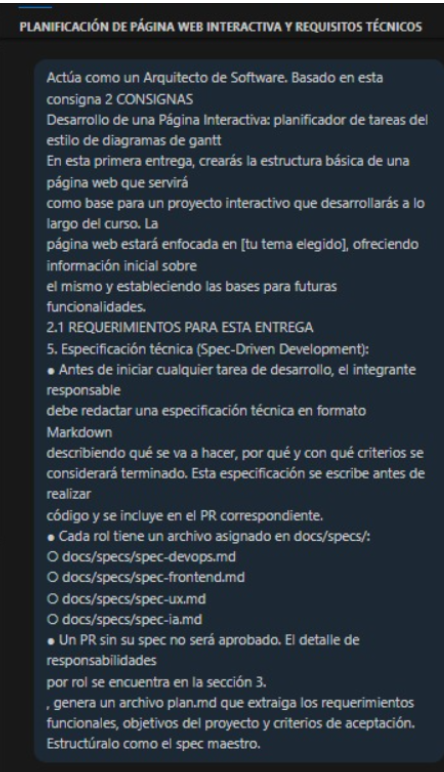
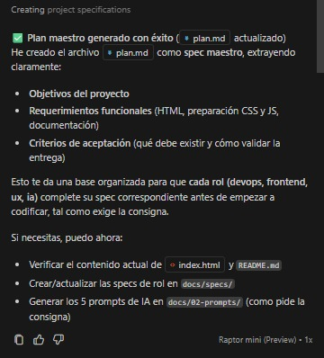

# Prompt 1 – Generación estructura del proyecto

## Modelo de IA

Raptor mini (versión de GPT-5-mini)

---

## Método de Prompt Engineering

Role Prompting

Se utilizó la técnica de **role prompting**, solicitando al modelo que actúe como **Arquitecto de Software**, con el objetivo de obtener una estructura técnica clara del documento `plan.md` siguiendo el enfoque de **Spec-Driven Development (SDD)**.

---

## Prompt exacto utilizado

``` 
Actúa como un Arquitecto de Software. Basado en esta consigna 2 CONSIGNAS 
Desarrollo de una Página Interactiva: planificador de tareas del estilo de diagramas de gantt 
En esta primera entrega, crearás la estructura básica de una página web que servirá 
como base para un proyecto interactivo que desarrollarás a lo largo del curso. La 
página web estará enfocada en [tu tema elegido], ofreciendo información inicial sobre 
el mismo y estableciendo las bases para futuras funcionalidades. 
2.1 REQUERIMIENTOS PARA ESTA ENTREGA 
5. Especificación técnica (Spec-Driven Development): 
● Antes de iniciar cualquier tarea de desarrollo, el integrante responsable 
debe redactar una especificación técnica en formato Markdown 
describiendo qué se va a hacer, por qué y con qué criterios se 
considerará terminado. Esta especificación se escribe antes de realizar 
código y se incluye en el PR correspondiente. 
● Cada rol tiene un archivo asignado en docs/specs/: 
○ docs/specs/spec-devops.md 
○ docs/specs/spec-frontend.md 
○ docs/specs/spec-ux.md 
○ docs/specs/spec-ia.md 
● Un PR sin su spec no será aprobado. El detalle de responsabilidades 
por rol se encuentra en la sección 3, genera un archivo plan.md que extraiga los requerimientos funcionales, objetivos del proyecto y criterios de aceptación. Estructúralo como el spec maestro.
```



---

## Resultado esperado

Se esperaba obtener un documento `plan.md` estructurado como **spec maestro del proyecto**, que definiera los objetivos, requerimientos funcionales y criterios de aceptación, sirviendo como documento de referencia para el desarrollo del sistema.

---

## Resultado obtenido

La IA generó un documento `plan.md` que incluye:

- descripción general del proyecto
- definición de los objetivos del sistema
- lista de requerimientos funcionales
- criterios de aceptación generales
- estructura organizada en formato Markdown

Este documento permitió establecer una base clara para las especificaciones técnicas de los distintos roles del equipo.



---

## Correcciones manuales realizadas

- No se realizaron correcciones significativas.
- El documento fue aceptado prácticamente en su totalidad como base para el proyecto.

---

## Archivo o parte del proyecto donde se aplicó

- Se genero el archivo `plan.md`