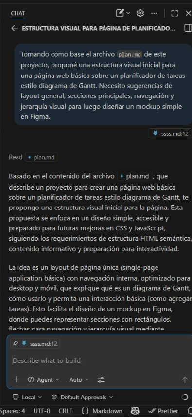
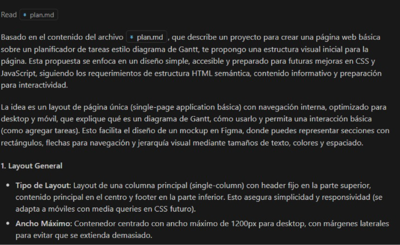
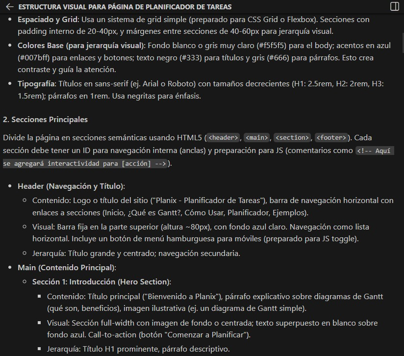
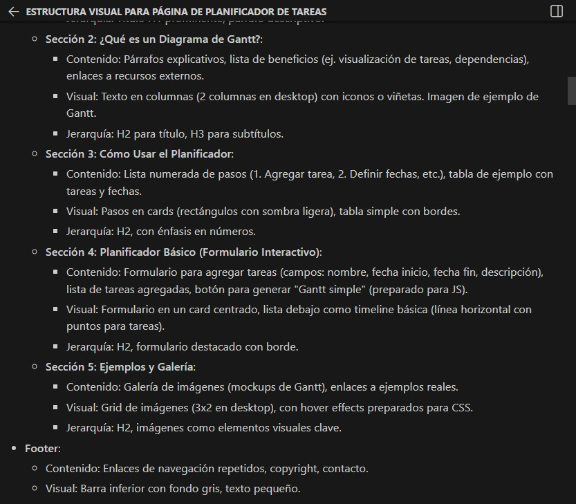
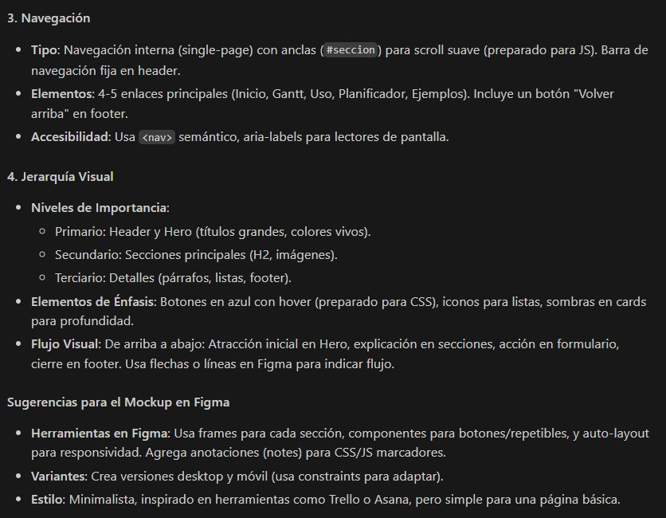

# Prompt 2 – Exploración de diseño inicial para mockup

Autor: Martin Debenedetti

## Modelo de IA

GitHub Copilot

---

## Método de Prompt Engineering

Zero-shot prompting

Se utilizó zero-shot prompting porque se solicitó directamente una propuesta de estructura visual sin proporcionar ejemplos previos, únicamente tomando como referencia el archivo `plan.md` del proyecto.

---

## Prompt exacto utilizado

```
Tomando como base el archivo plan.md de este proyecto, proponé una estructura visual inicial para una página web básica sobre un planificador de tareas estilo diagrama de Gantt.
Necesito sugerencias de layout general, secciones principales, navegación y jerarquía visual para luego diseñar un mockup simple en Figma.
```



---

## Resultado esperado

Se esperaba obtener una propuesta estructural clara para diseñar el mockup del planificador de tareas tipo Gantt, incluyendo:

- organización general del layout
- definición de secciones principales
- sugerencias de navegación
- jerarquía visual para guiar el diseño en Figma

---

## Resultado obtenido

La IA propuso una estructura compuesta por:

- un header con título del proyecto y navegación principal;
- una sección introductoria explicando qué es un diagrama de Gantt;
- una sección con casos de uso;
- una sección con formulario para carga de tareas;
- una sección con una tabla simulando un diagrama de Gantt;
- una sección de recursos y enlaces;
- un footer con información general.

La propuesta sirvió como base conceptual para el desarrollo del mockup inicial.






---

## Correcciones manuales realizadas

Al comparar la propuesta inicial con el mockup final, se realizaron los siguientes ajustes:

### Elementos incorporados

- encabezado con nombre del proyecto;
- navegación superior simple;
- panel lateral con datos de tareas;
- área principal para representar el cronograma y sus barras;
- espacio para filtros;
- pie de página con información general.

### Elementos descartados o simplificados

- la sección introductoria extensa fue reducida para evitar exceso de texto en esta versión inicial;
- la sección de casos de uso no se incorporó, priorizando una interfaz más centrada en la visualización del planificador;
- la sección de recursos y enlaces se dejó fuera por no ser prioritaria;
- el formulario de carga de tareas no se desarrolló como bloque independiente, sino que se reinterpretó mediante panel lateral y filtros;
- no se incluyeron múltiples pantallas ni interacciones complejas, ya que el objetivo era definir una base visual clara y no una versión final navegable.

---

## Archivo o parte del proyecto donde se aplicó

- Mockup inicial en Figma
- Definición de estructura visual en el diseño UX
- Referencia para desarrollo posterior en `index.html`
