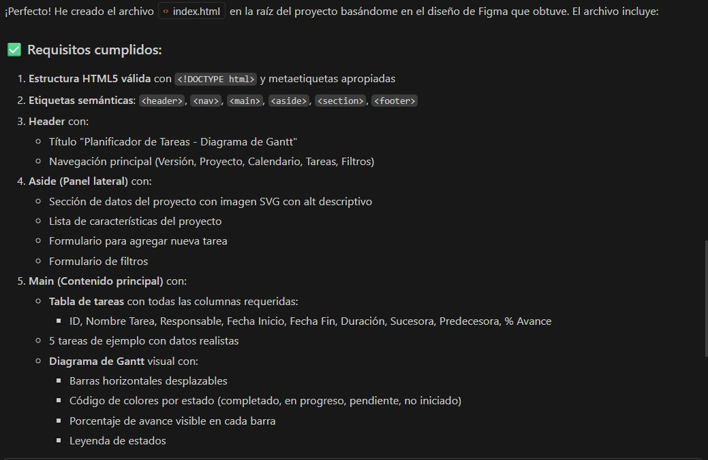

# Prompt 3 — Generación de estructura HTML desde mockup de Figma

## Modelo de IA

GitHub Copilot (modo Agente) integrado a Visual Studio Code (Claude Haiku 4.5)

---

## Método de Prompt Engineering

- Role prompting: asumiendo el rol de desarrollador frontend
- Few-shot prompting: con ejemplos de estructura y requisitos

---

## Prompt exacto utilizado

```
Actuá como desarrollador frontend. Tu tarea es crear el archivo index.html
    en la raíz del proyecto, siguiendo el mockup de Figma y los lineamientos
    del plan.md y spec-frontend.md.

    Contexto del proyecto:
    - Es un planificador de tareas estilo diagrama de Gantt
    - El mockup de referencia está en:
      docs/01-mockup/actividad-obligatoria-1/diseño-inicial.png
    - El plan general está en plan.md
    - La spec de este rol está en docs/03-specs/spec-frontend.md

    Requisitos obligatorios del index.html:
    1. Declaración <!DOCTYPE html> y estructura HTML5 válida
    2. Etiquetas semánticas: <header>, <nav>, <main>, <aside>, <section>, <footer>
    3. Un <header> con el nombre del proyecto y navegación principal
    4. Un <aside> o panel lateral con datos de tareas (nombre, fecha inicio,
       fecha fin, duración, responsable, estado)
    5. Un <section> principal con una <table> que represente el diagrama
       de Gantt (columnas: tarea, inicio, fin, duración, avance)
    6. Un <form> básico para agregar o filtrar tareas
    7. Al menos una  con atributo alt descriptivo
    8. Al menos una <ul> o <ol> con ítems relacionados al proyecto
    9. Al menos un <a> con enlace relevante
    10. Atributos de accesibilidad en todos los elementos interactivos
        (aria-label, alt, etc.)
    11. Comentarios <!-- TODO: CSS - [descripción] --> donde corresponda
        aplicar estilos en el futuro
    12. Comentarios <!-- TODO: JS - [descripción] --> donde corresponda
        agregar interactividad
    13. Todo el contenido en español

    Usá el servidor MCP de Figma con este enlace para extraer la estructura
    visual del diseño:
    https://www.figma.com/design/v1QKUD77dcsM0WDRMHapz6/Mockup-UX---Planificador-Gantt?node-id=0-1

    Generá el archivo completo index.html respetando estos requisitos
    y la estructura visual del mockup.

```


---

## Resultado esperado

Archivo `index.html` con estructura HTML5 semántica que refleje el layout del mockup: encabezado con nombre del proyecto, tabla de tareas a la izquierda y diagrama de Gantt a la derecha con escala temporal, formulario de nueva tarea en la parte superior, y footer con información del proyecto.

---

## Resultado obtenido

La IA  generó un HTML con estructura general correcta pero con layout incorrecto — colocó la escala de tiempo y las barras del Gantt debajo de la tabla de tareas en lugar de al costado derecho. El contenido era válido pero no reflejaba fielmente el mockup.


---

## Correcciones manuales realizadas

- Se reestructuró el HTML para usar una tabla unificada donde cada fila
  contiene los datos de la tarea (izquierda) y su barra de Gantt (derecha)
- El `<thead>` se dividió en dos filas: meses (con colspan) y semanas
- Se ajustaron los colspan de cada barra según las fechas reales de cada tarea
- Se agregó `aria-hidden="true"` en celdas vacías del diagrama
- Se reorganizó el formulario de nueva tarea para que quede arriba del
  bloque tabla+Gantt
- Se documentaron las decisiones en `docs/03-specs/spec-frontend.md`

---

## Archivo o parte del proyecto donde se aplicó

- `index.html` (creado en la raíz del repositorio)
- `docs/03-specs/spec-frontend.md` (documentación de decisiones)
