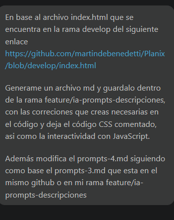
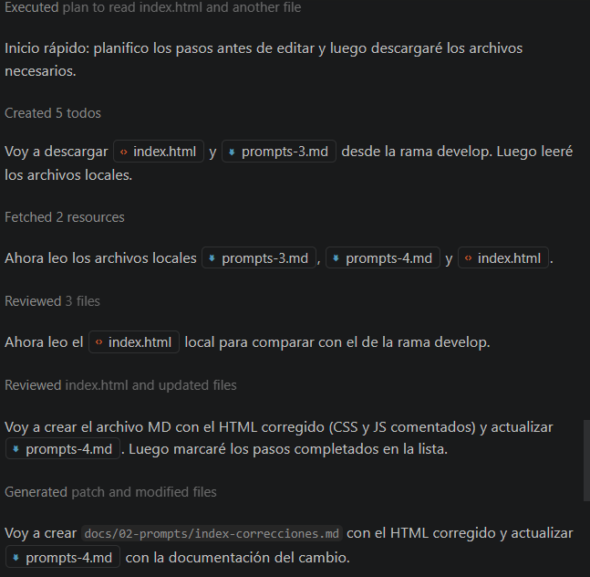
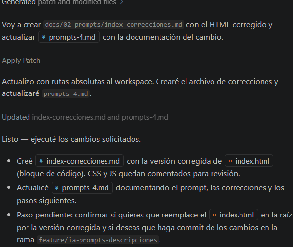

# Prompt 4 — Corrección y documentación de `index.html`

## Modelo de IA

Asistente automatizado (integración con VS Code) — GPT 5 mini

---

## Método de Prompt Engineering

Few-shot prompting ya que se le paso un archivo ya generado para generar luego los demás

---

## Prompt exacto utilizado

```
En base al archivo index.html que se encuentra en la rama develop del siguiente enlace https://github.com/martindebenedetti/Planix/blob/develop/index.html

Generame un archivo md y guardalo dentro de la rama feature/ia-prompts-descripciones, con las correciones que creas necesarias en el código y deja el código CSS comentado, asi como la interactividad con JavaScript.

Además modifica el prompts-4.md siguiendo como base el prompts-3.md que esta en el mismo github o en mi rama feature/ia-prompts-descripciones
```


---

## Resultado esperado

- Un archivo markdown `docs/02-prompts/index-correcciones.md` que contenga el
	`index.html` corregido en un bloque de código, con CSS y JS comentados.
- `docs/02-prompts/prompts-4.md` (este archivo) documentando el proceso y
	listando los cambios.

---

## Resultado obtenido

- Se creó `docs/02-prompts/index-correcciones.md` con la versión corregida y
	anotada del `index.html` (CSS y JS comentados). El archivo incluye:
	- Metadatos y meta tags completos.
	- Estructura semántica (`header`, `nav`, `main`, `footer`).
	- Formulario de nueva tarea con campos mínimos y accesibilidad (aria-*).
	- Tabla unificada para datos + diagrama de Gantt con encabezado en dos
		filas (meses y semanas).



---

## Correcciones aplicadas

- Limpieza y normalización del DOCTYPE y meta viewport.
- Estandarización de etiquetas semánticas y atributos `aria` en elementos
	interactivos.
- Inclusión de código CSS ejemplo en un bloque comentado para evitar ruptura
	visual inmediata al pegar el HTML.
- Inclusión de ejemplo de inicialización JS comentado con un `submit` básico
	para futuros desarrollos dinámicos.

---

## Archivos modificados/creados

- `docs/02-prompts/index-correcciones.md` — archivo nuevo con el HTML
	corregido y anotado.
- `docs/02-prompts/prompts-4.md` — (este archivo) documentando el cambio.

---

## Siguientes pasos recomendados

- Revisar el CSS comentado y adaptarlo a la guía de estilos del proyecto.
- Implementar la generación dinámica de filas del Gantt con JS y descomentar
	el bloque cuando esté listo.
- Si quieres, reemplazo `index.html` en la raíz con la versión corregida y
	activo CSS/JS bajo tu aprobación.

