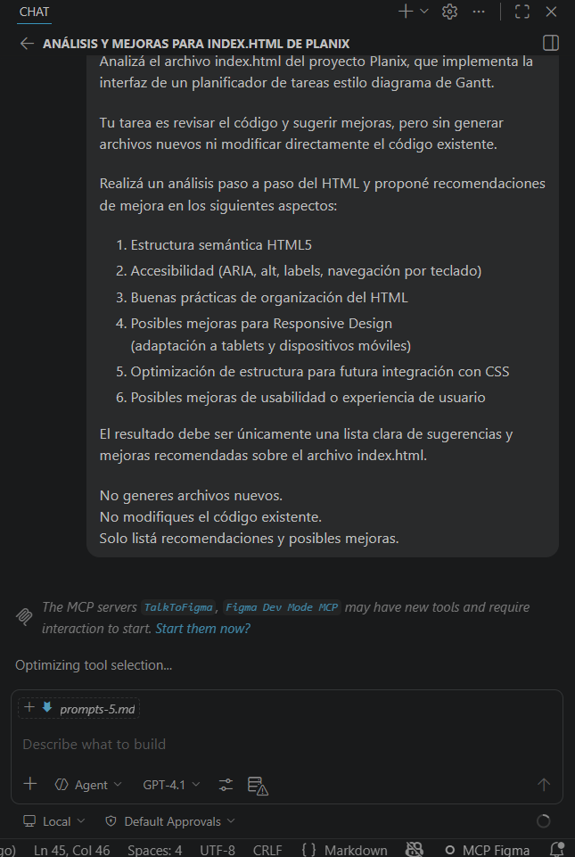
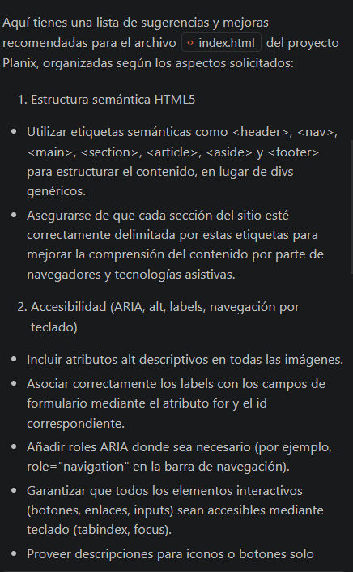
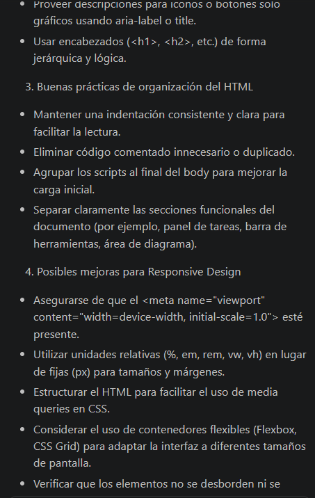
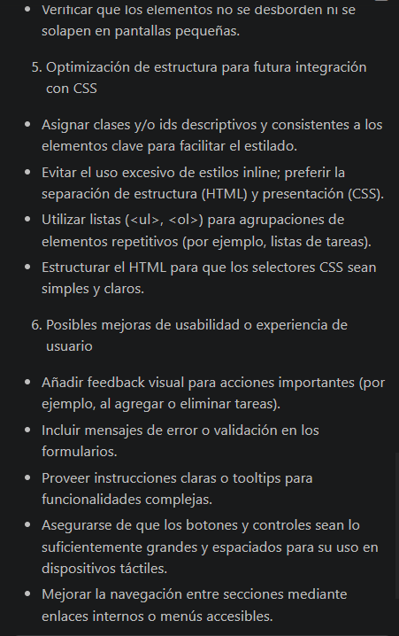

# Prompt 5 — Optimización y validación del código

Autor: Gian Franco Pasquali

## Modelo de IA

Asistente automatizado (integración con VS Code) — Gpt-4.1

---

## Método de Prompt Engineering

- Zero-shot prompting
- Chain-of-thought prompting para análisis paso a paso del código

---

## Prompt exacto utilizado

```
Analizá el archivo index.html del proyecto Planix, que implementa la
interfaz de un planificador de tareas estilo diagrama de Gantt.

Tu tarea es revisar el código y sugerir mejoras, pero sin generar
archivos nuevos ni modificar directamente el código existente.

Realizá un análisis paso a paso del HTML y proponé recomendaciones
de mejora en los siguientes aspectos:

Estructura semántica HTML5
Accesibilidad (ARIA, alt, labels, navegación por teclado)
Buenas prácticas de organización del HTML
Posibles mejoras para Responsive Design
(adaptación a tablets y dispositivos móviles)
Optimización de estructura para futura integración con CSS
Posibles mejoras de usabilidad o experiencia de usuario
El resultado debe ser únicamente una lista clara de sugerencias y
mejoras recomendadas sobre el archivo index.html.

No generes archivos nuevos.
No modifiques el código existente.
Solo listá recomendaciones y posibles mejoras.
```


---

## Resultado esperado

Una lista de recomendaciones para mejorar el archivo index.html, enfocadas en:

- Mejoras de accesibilidad
- Organización del HTML
- Preparación para estilos CSS
- Mejoras para responsive design

---

## Resultado obtenido

Se obtuvo  una lista de sugerencias y mejoras recomendadas para el archivo index.html del proyecto Planix, organizadas según los aspectos solicitados:

1) Estructura semántica HTML5
 - Utilizar etiquetas semánticas como <header>, <nav>, <main>, <section>, <article>, <aside> y <footer> para estructurar el contenido, en lugar de divs genéricos.
 - Asegurarse de que cada sección del sitio esté correctamente delimitada por estas etiquetas para mejorar la comprensión del contenido por parte de navegadores y tecnologías asistivas.
 
2) Accesibilidad (ARIA, alt, labels, navegación por teclado)
 - Incluir atributos alt descriptivos en todas las imágenes.
 - Asociar correctamente los labels con los campos de formulario mediante el atributo for y el id correspondiente.
 - Añadir roles ARIA donde sea necesario (por ejemplo, role="navigation" en la barra de navegación).
 - Garantizar que todos los elementos interactivos (botones, enlaces, inputs) sean accesibles mediante teclado (tabindex, focus).
 - Proveer descripciones para iconos o botones solo gráficos usando aria-label o title.
 - Usar encabezados (<h1>, <h2>, etc.) de forma jerárquica y lógica.

3) Buenas prácticas de organización del HTML
 - Mantener una indentación consistente y clara para facilitar la lectura.
 - Eliminar código comentado innecesario o duplicado.
 - Agrupar los scripts al final del body para mejorar la carga inicial.
 - Separar claramente las secciones funcionales del documento (por ejemplo, panel de tareas, barra de herramientas, área de diagrama).

4) Posibles mejoras para Responsive Design
 - Asegurarse de que el <meta name="viewport" content="width=device-width, initial-scale=1.0"> esté presente.
 - Utilizar unidades relativas (%, em, rem, vw, vh) en lugar de fijas (px) para tamaños y márgenes.
 - Estructurar el HTML para facilitar el uso de media queries en CSS.
 - Considerar el uso de contenedores flexibles (Flexbox, CSS Grid) para adaptar la interfaz a diferentes tamaños de pantalla.
 - Verificar que los elementos no se desborden ni se solapen en pantallas pequeñas.

5) Optimización de estructura para futura integración con CSS
 - Asignar clases y/o ids descriptivos y consistentes a los elementos clave para facilitar el estilado.
 - Evitar el uso excesivo de estilos inline; preferir la separación de estructura (HTML) y presentación (CSS).
 - Utilizar listas (<ul>, <ol>) para agrupaciones de elementos repetitivos (por ejemplo, listas de tareas).
 - Estructurar el HTML para que los selectores CSS sean simples y claros.

6) Posibles mejoras de usabilidad o experiencia de usuario
 - Añadir feedback visual para acciones importantes (por ejemplo, al agregar o eliminar tareas).
 - Incluir mensajes de error o validación en los formularios.
 - Proveer instrucciones claras o tooltips para funcionalidades complejas.
 - Asegurarse de que los botones y controles sean lo suficientemente grandes y espaciados para su uso en dispositivos táctiles.
 Mejorar la navegación entre secciones mediante enlaces internos o menús accesibles.

Estas recomendaciones ayudarán a mejorar la calidad, accesibilidad y mantenibilidad del archivo index.html, así como la experiencia de usuario en el planificador Planix.






---

## Correcciones aplicadas

- Por el momento no se aplicaron correcciones.

---

## Archivos modificados/creados

- `docs/02-prompts/prompts-5.md` — (este archivo) documentando el proceso y mejoras.

---

## Siguientes pasos recomendados

- Revisar e incluir progresivamente las sugerencias  en CSS.
- Adaptar el CSS a la guía de estilos definitiva del proyecto.
- Modularizar la lógica JS para escalabilidad y mantenibilidad.
- Validar la accesibilidad y compatibilidad en navegadores modernos.
