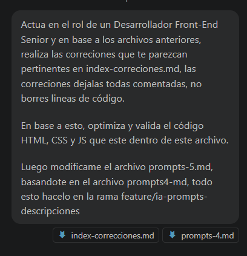

# Prompt 5 — Optimización y validación del código

## Modelo de IA

Asistente automatizado (integración con VS Code) — Gpt-4.1

---

## Método de Prompt Engineering

- Few-shot prompting, partiendo de archivos generados y mejorados previamente
- Role prompting, que actue como un desarrollador front end

---

## Prompt exacto utilizado

```
Actuá en el rol de un Desarrollador Front-End Senior y en base a los archivos anteriores, realiza las correciones que te parezcan pertinentes en index-correciones.md, las correciones dejalas todas comentadas, no borres lineas de código.

En base a esto, optimiza y valida el código HTML, CSS y JS que este dentro de este archivo.

Luego modificame el archivo prompts-5.md, basandote en el archivo prompts4-md, todo esto hacelo en la rama feature/ia-prompts-descripciones
```


---

## Resultado esperado

- Archivo markdown `docs/02-prompts/index-correcciones.md` optimizado, con sugerencias y correcciones comentadas.
- Archivo `docs/02-prompts/prompts-5.md` (este archivo) documentando el proceso, mejoras y recomendaciones.

---

## Resultado obtenido

- Se optimizó y validó el archivo `docs/02-prompts/index-correcciones.md`:
- Se agregaron sugerencias de accesibilidad y buenas prácticas CSS (focus-visible, box-sizing, importación de fuentes).
- Se mejoró la estructura y robustez del bloque JavaScript, recomendando modularización y validación de campos.
- Todas las correcciones y sugerencias se dejaron como comentarios, sin eliminar líneas originales.
- Se creó este archivo `prompts-5.md` documentando el proceso y las recomendaciones.


---

## Correcciones aplicadas

- Sugerencias de accesibilidad en CSS (`:focus-visible`, `box-sizing`).
- Recomendación de importar fuentes externas para mejor compatibilidad.
- Mejoras en la robustez del JS: validación de existencia de elementos y modularización sugerida.
- Todas las sugerencias y mejoras están comentadas para revisión progresiva.

---

## Archivos modificados/creados

- `docs/02-prompts/index-correcciones.md` — optimizado y comentado.
- `docs/02-prompts/prompts-5.md` — (este archivo) documentando el proceso y mejoras.

---

## Siguientes pasos recomendados

- Revisar y activar progresivamente las sugerencias comentadas en CSS y JS.
- Adaptar el CSS a la guía de estilos definitiva del proyecto.
- Modularizar la lógica JS para escalabilidad y mantenibilidad.
- Validar la accesibilidad y compatibilidad en navegadores modernos.
