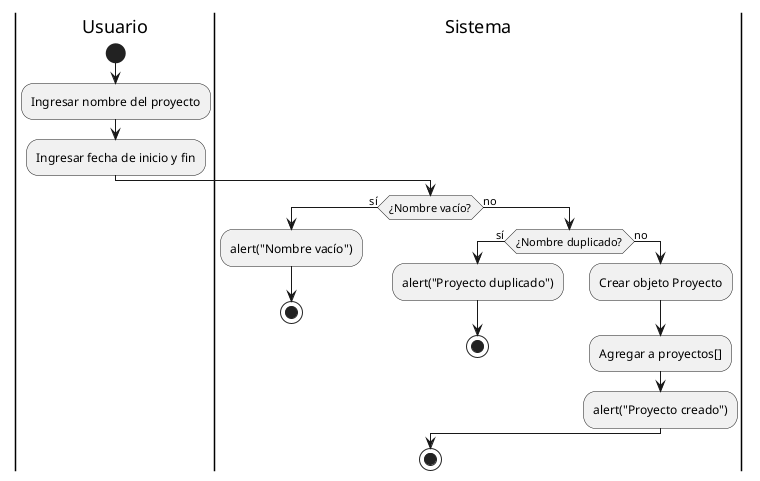

# Spec: Arquitecto de Diagramas de Actividades

**Actividad Obligatoria N°3 | Programación Web I | UCES**  
**Estudiante:** Martin Debenedetti  
**Proyecto:** Planificador de Tareas - Diagrama de Gantt (Planix)  
**Rama:** `feature/arq-diagramas-actividades`

---

## 📋 Plan de Diseño

> ⚠️ Esta sección fue commiteada **antes** de abrir Copilot o escribir cualquier archivo `.puml`.

### Identificación de los 4 flujos principales

Los flujos fueron identificados a partir de la revisión del `plan.md`, el `index.html`
y el mockup visual del proyecto Planix. Se seleccionaron los 4 casos de uso centrales
de la aplicación Gantt chart, cubriendo el ciclo completo: crear → cargar → medir → consultar.

---

**Flujo 1: Crear Proyecto**

- **Actor principal:** Usuario
- **Entrada:** nombre del proyecto (string), fecha de inicio (DD/MM/AAAA), fecha de fin (DD/MM/AAAA)
- **Procesos clave:**
  1. Validar que el nombre no esté vacío
  2. Verificar que no exista un proyecto duplicado con ese nombre
  3. Validar el formato de la fecha de inicio (DD/MM/AAAA)
  4. Validar el formato de la fecha de fin (DD/MM/AAAA)
  5. Validar que la fecha de fin sea posterior a la de inicio
  6. Crear objeto `Proyecto { nombre, fechaInicio, fechaFin, tareas: [] }`
  7. Agregar el proyecto al array global `proyectos[]`
- **Salida:** confirmación de creación o mensaje de error específico
- **Decisiones clave:** nombre vacío, nombre duplicado, formato de fechas inválido, fechaFin <= fechaInicio
- **¿Tiene ciclos?** No
- **Estructuras de datos:** objeto `Proyecto`, array global `proyectos[]`

---

**Flujo 2: Agregar Tarea a Proyecto**

- **Actor principal:** Usuario
- **Entrada:** nombre del proyecto (string), nombre de tarea (string), responsable (string), estado inicial (1/2/3)
- **Procesos clave:**
  1. Verificar que existan proyectos cargados
  2. Construir y mostrar la lista de proyectos disponibles (for)
  3. Buscar el proyecto seleccionado por nombre
  4. Validar que el nombre de la tarea no esté vacío
  5. Validar que el responsable no esté vacío
  6. Asignar estado según opción elegida (switch: 1=pendiente, 2=en curso, 3=completada)
  7. Crear objeto `Tarea { nombre, responsable, estado }`
  8. Agregar la tarea al array `tareas[]` del proyecto seleccionado
- **Salida:** confirmación con datos de la tarea creada, o mensaje de error
- **Decisiones clave:** proyectos existentes, proyecto encontrado, campos vacíos, estado válido (switch)
- **¿Tiene ciclos?** Sí — `for` para construir la lista de proyectos
- **Estructuras de datos:** objeto `Tarea`, array `proyecto.tareas[]`

---

**Flujo 3: Calcular Avance del Proyecto**

- **Actor principal:** Usuario
- **Entrada:** nombre del proyecto (string)
- **Procesos clave:**
  1. Verificar que existan proyectos cargados
  2. Mostrar lista de proyectos y buscar el seleccionado
  3. Verificar que el proyecto tenga tareas cargadas
  4. Recorrer el array `tareas[]` con `while` contando tareas completadas
  5. Calcular porcentaje: `(completadas / total) * 100`
  6. Comparar fecha de fin del proyecto con la fecha actual (`Date()`)
  7. Determinar estado: "En curso" / "Atrasado" / "Completado" / "Completado antes del plazo"
  8. Mostrar informe completo
- **Salida:** informe con porcentaje de avance, tareas completadas/total y estado del proyecto
- **Decisiones clave:** proyectos existentes, proyecto encontrado, tareas cargadas, fecha vencida, avance = 100%
- **¿Tiene ciclos?** Sí — `while` para recorrer `tareas[]` y contar completadas
- **Estructuras de datos:** array `proyecto.tareas[]`, objeto `Date`

---

**Flujo 4: Listar y Filtrar Tareas**

- **Actor principal:** Usuario
- **Entrada:** nombre del proyecto (string), criterio de filtro (1/2/3/4)
- **Procesos clave:**
  1. Verificar que existan proyectos cargados
  2. Mostrar lista de proyectos y buscar el seleccionado
  3. Verificar que el proyecto tenga tareas cargadas
  4. Validar la opción de filtro elegida (switch: 1=pendiente, 2=en curso, 3=completada, 4=todas)
  5. Recorrer `tareas[]` con `while` y agregar a `tareasFiltradas[]` las que coincidan con el criterio
  6. Verificar que el resultado no esté vacío
  7. Construir texto con los datos de cada tarea filtrada (for)
  8. Mostrar resultado por `alert()` y `console.log()`
- **Salida:** listado de tareas filtradas con nombre, responsable y estado; o mensaje de "sin resultados"
- **Decisiones clave:** proyectos existentes, proyecto encontrado, tareas cargadas, filtro válido, resultado vacío
- **¿Tiene ciclos?** Sí — `while` para filtrar tareas + `for` para construir el texto de salida
- **Estructuras de datos:** array `tareasFiltradas[]`, array `proyecto.tareas[]`

---

### Decisión sobre Swimlanes (Particiones)

Se decidió aplicar swimlanes en los **4 flujos**, ya que en todos existe una
separación clara entre las acciones que ejecuta el usuario (ingresar datos, elegir opciones),
las respuestas que da la interfaz (mostrar alertas, pedir datos) y
la lógica de negocio pura (validar, calcular, almacenar).

| Flujo                     | Swimlanes                                            | Justificación                                                                         |
| ------------------------- | ---------------------------------------------------- | ------------------------------------------------------------------------------------- |
| Flujo 1 — Crear Proyecto  | ✅ Usuario / Interfaz de Usuario / Lógica de Negocio | El usuario ingresa datos; la lógica valida y crea el objeto; la interfaz notifica     |
| Flujo 2 — Agregar Tarea   | ✅ Usuario / Interfaz de Usuario / Lógica de Negocio | El usuario elige opciones; la lógica busca, valida y persiste; la interfaz notifica   |
| Flujo 3 — Calcular Avance | ✅ Usuario / Interfaz de Usuario / Lógica de Negocio | El usuario selecciona proyecto; la lógica calcula métricas; la interfaz emite informe |
| Flujo 4 — Filtrar Tareas  | ✅ Usuario / Interfaz de Usuario / Lógica de Negocio | El usuario elige filtro; la lógica recorre y filtra; la interfaz muestra listado      |

---

### Criterios de aceptación — Checklist

- [x] 4 diagramas con `start`, `stop` o `end`, actividades (`:texto;`), decisiones (`if-then-else`) y ciclos (`while` / `for`)
- [x] Swimlanes `|Usuario|`, `|Interfaz de Usuario|` y `|Lógica de Negocio|` presentes en los 4 flujos
- [x] Flujo lógico coherente con la implementación planificada en `plan.md`
- [x] Archivos `.puml` (editable) y `.png` (visualización) exportados para cada diagrama
- [x] `diagramas-doc.md` con índice, descripción, enlaces e instrucciones de edición
- [x] `spec-arq-diagramas.md` commiteado **antes** que cualquier archivo `.puml`

---

## 🤖 Uso de Copilot Agent Mode

### Prompt exacto utilizado en Copilot Agent

```
Eres un experto en diagramas de actividades con PlantUML.

Necesito que generes 4 diagramas de actividades para "Planix",
una aplicación web de gestión de proyectos estilo Gantt chart.

CONTEXTO DEL PROYECTO:
- App web para gestionar proyectos y tareas con vista tipo Gantt
- Lógica implementada en JavaScript puro (sin DOM en esta entrega)
- La interacción con el usuario es mediante prompt() y alert()
- Los datos se almacenan en arrays y objetos en memoria

ARCHIVOS A GENERAR (respetar nombres exactos):
Carpeta destino: docs/05-diagramas/01-diagrama-de-actividades/

1. actividad-flujo-1-crear-proyecto.puml
2. actividad-flujo-2-agregar-tarea.puml
3. actividad-flujo-3-calcular-avance.puml
4. actividad-flujo-4-filtrar-tareas.puml
5. diagramas-doc.md  ← índice y documentación de los 4 diagramas

El @startuml de cada archivo debe usar el nombre del archivo sin extensión.
Ejemplo: @startuml actividad-flujo-1-crear-proyecto

REQUERIMIENTOS OBLIGATORIOS PARA CADA DIAGRAMA:
1. Sintaxis moderna de PlantUML (activity diagram beta)
2. @startuml [nombre-del-archivo] y @enduml delimitando cada diagrama
3. start y stop claramente marcados
4. Actividades con sintaxis :Nombre de la actividad;
5. Decisiones condicionales con if ("condición") then (sí) / else (no) / endif
6. Ciclos con while ("condición") / endwhile donde aplique
7. Swimlanes |Usuario| y |Sistema| en todos los flujos
8. Flujo lógico completo y coherente, sin pasos faltantes

FLUJO 1 — actividad-flujo-1-crear-proyecto.puml:
El usuario ingresa nombre, fecha de inicio y fecha de fin.
Validaciones: nombre no vacío, nombre no duplicado en el array proyectos[],
formato de fecha DD/MM/AAAA válido para ambas fechas,
fecha de fin posterior a fecha de inicio.
Si todo es válido: crear objeto Proyecto y agregarlo al array proyectos[].
Mostrar confirmación o error específico según el caso.

FLUJO 2 — actividad-flujo-2-agregar-tarea.puml:
Verificar que existan proyectos. Mostrar lista con for.
El usuario elige proyecto por nombre. Buscar en el array.
El usuario ingresa nombre de tarea, responsable y estado
(switch: 1=pendiente, 2=en curso, 3=completada).
Validar cada campo. Crear objeto Tarea y agregarlo a proyecto.tareas[].
Mostrar confirmación o error.

FLUJO 3 — actividad-flujo-3-calcular-avance.puml:
Verificar proyectos existentes. Mostrar lista. Usuario elige proyecto.
Verificar que tenga tareas. Recorrer tareas[] con while contando completadas.
Calcular porcentaje. Comparar fecha fin con fecha actual (Date()).
Determinar estado: "En curso" / "Atrasado" / "Completado" / "Completado antes del plazo".
Mostrar informe completo.

FLUJO 4 — actividad-flujo-4-filtrar-tareas.puml:
Verificar proyectos y tareas. Mostrar lista de proyectos.
Usuario elige proyecto y filtro
(switch: 1=pendiente, 2=en curso, 3=completada, 4=todas).
Recorrer tareas[] con while y acumular coincidencias en tareasFiltradas[].
Si resultado vacío: informar. Si tiene datos: mostrar listado por alert() y console.log().

REQUERIMIENTOS PARA diagramas-doc.md:
- Título: "Diagramas de Actividades - Planix"
- Índice con links a los 4 flujos usando anclas markdown
- Por cada flujo: descripción breve, imagen embebida 
  y link al .puml editable
- Sección final con instrucciones para editar en VS Code y en plantumleditor.com
```

### Output generado por Copilot



### Ajustes manuales realizados

Se corrigieron errores menores de sintaxis generados por Copilot. Principalmente, Copilot anidaba en exceso las condicionales (`if/else`), lo que hacía que el diagrama creciera horizontalmente de forma desproporcionada. Además, los cambios de Swimlane no estaban aplicados correctamente al final de cada flujo (el sistema emitía los alerts cuando debía ser el usuario quien los recibe/ve). Por último, se adaptó la sintaxis de ciclos para alinearla con la representación correcta en la sintaxis beta de PlantUML.

---

## ✅ AL CERRAR — Evidencia de Trabajo

### Fragmento del .puml generado por Copilot (antes de ajustes)


### Ajustes manuales por diagrama

**Flujo 1:**

- Error encontrado: Anidamiento excesivo de `if/else` y mensajes de confirmación/error renderizados en el swimlane del Sistema en lugar del Usuario.
- Ajuste realizado: Se refactorizaron las validaciones utilizando `elseif` para reducir el crecimiento horizontal y se agregaron los saltos correctos al swimlane `|Usuario|` antes de cada `alert()`.

**Flujo 2:**

- Error encontrado: Problemas semánticos al mezclar un ciclo `for` con lecturas de arreglo, y anidamiento incorrecto del `switch` de estados.
- Ajuste realizado: Se ajustó la sintaxis a un ciclo de repetición (`while`) para la iteración de proyectos y se reemplazó la lógica del `switch` por condicionales `elseif` encadenados.

**Flujo 3:**

- Error encontrado: Faltaba inicializar variables antes del ciclo y el flujo terminaba en el swimlane incorrecto sin la etiqueta `stop`.
- Ajuste realizado: Se insertaron actividades de inicialización previas al `while` y se aseguró que el informe final mediante `alert()` se mostrara en el swimlane de `|Usuario|` seguido de un `stop`.

**Flujo 4:**

- Error encontrado: Validaciones con ramas `else` vacías (flechas sueltas) que rompían la validación del parser de PlantUML.
- Ajuste realizado: Se reestructuró la validación del filtro explicitando salidas claras hacia alertas cuando el resultado queda vacío y se corrigió la sintaxis de ciclos anidados.

---

### Checklist de cierre

- [x] 4 archivos `.puml` commiteados en `docs/05-diagramas/01-diagrama-de-actividades/`
- [x] 4 archivos `.png` exportados y commiteados en la misma carpeta
- [x] `diagramas-doc.md` creado con índice, descripciones, imágenes y enlaces
- [x] `spec-arq-diagramas.md` completado con secciones DURANTE y AL CERRAR
- [x] PR `feature/arq-diagramas-actividades` → `develop` creada
- [x] Coordinador notificado para code review
- [x] `changelog.md` actualizado con el aporte y link a la PR
