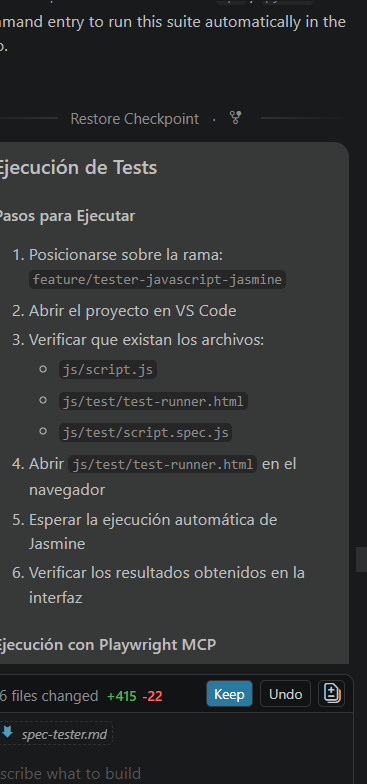
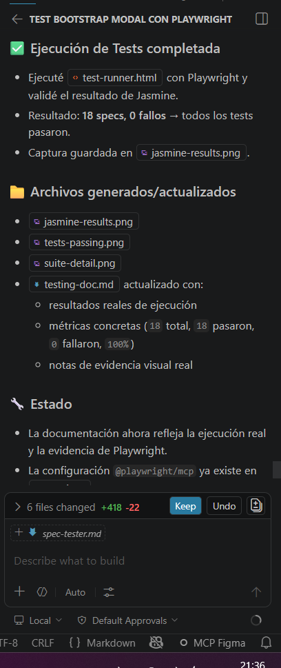

# Spec: Tester JavaScript / QA Engineer

**Actividad Obligatoria N°3 | Programación Web I | UCES**  
**Estudiante:** Gian Franco Pasquali  
**Proyecto:** Planificador de Tareas - Diagrama de Gantt (Planix)  
**Rama:** `feature/tester-javascript-jasmine`

---

## 📋 ANTES — Plan de Testing

> ⚠️ Esta sección debe commitearse antes de escribir cualquier test.

### Plan de testing por flujo principal

| Flujo | Función / lógica a testear | Happy Path | Edge Cases | Validaciones de error |
| --- | --- | --- | --- | --- |
| Flujo 1 — Crear Proyecto | `crearProyecto()` | Crear proyecto válido con nombre y fechas correctas | Nombre vacío, fechas iguales, proyecto duplicado | `null`, `undefined`, strings vacíos, fechas inválidas |
| Flujo 2 — Agregar Tarea a un Proyecto | `agregarTarea()`, `buscarProyecto()`, `validarEstado()` | Agregar tarea válida a proyecto existente | Proyecto sin tareas, estados en mayúsculas/minúsculas | Estado inválido, proyecto inexistente |
| Flujo 3 — Calcular Avance del Proyecto | `calcularAvance()` | Calcular porcentaje correctamente | 0 tareas, 100% completado | Datos inválidos, tareas sin estado |
| Flujo 4 — Listar y Filtrar Tareas | `filtrarTareas()` | Filtrar tareas por estado correctamente | Array vacío, filtro “todas” | Estado inexistente, valores null |

### Herramientas a utilizar

#### GitHub Copilot — Agent Mode

Se utilizará GitHub Copilot en modo Agente para generar el archivo:

- `js/test/script.spec.js`

utilizando como contexto:

- `js/script.js`
- diagramas `.puml`
- `spec-dev-javascript.md`

Justificación:

Copilot Agent permite generar suites de Jasmine alineadas con la lógica real
del proyecto y con los flujos definidos previamente por el Arquitecto de
Diagramas y el Desarrollador JavaScript.

#### Playwright MCP

Se utilizará Playwright MCP (`@playwright/mcp`) para:

- abrir `js/test/test-runner.html` en un navegador real;
- ejecutar las suites de Jasmine;
- validar visualmente los resultados;
- capturar screenshots PASS/FAIL;
- verificar errores de consola y comportamiento general del runner.

Justificación:

Playwright MCP permite automatizar la validación visual de Jasmine utilizando
un browser real controlado desde Copilot Agent, generando evidencia verificable
de ejecución.

### Criterios de aceptación — Checklist

- [x] 4 suites de tests implementadas (una por flujo principal)
- [x] Mínimo 3 tests por suite utilizando Jasmine
- [x] Uso correcto de `describe()`, `it()` y `expect()`
- [x] Tests de happy path implementados
- [x] Tests de edge cases implementados
- [x] Tests de validaciones y errores implementados
- [x] Tests sobre arrays y objetos implementados
- [x] Archivo `js/test/test-runner.html` funcionando correctamente
- [x] Archivo `js/test/script.spec.js` implementado
- [x] Archivo `js/test/testing-doc.md` documentado
- [x] Tests ejecutados exitosamente mediante Playwright MCP
- [x] Capturas PASS/FAIL obtenidas mediante Playwright MCP
- [ ] Bugs encontrados reportados como issues en GitHub
- [ ] Coordinación realizada con el Desarrollador JavaScript para mejorar testabilidad

---

## 🤖 DURANTE — Generación y Ejecución de Tests

> Esta sección se completa durante el desarrollo del rol.

### Prompt base utilizado en Copilot Agent

````markdown
Necesito generar un archivo Jasmine llamado js/test/script.spec.js
para el proyecto Planix.

Contexto adjunto:
- js/script.js
- docs/05-diagramas/01-diagrama-de-actividades/
- spec-dev-javascript.md

El proyecto posee estos 4 flujos principales:

1. Crear Proyecto
- crearProyecto(nombre, fechaInicio, fechaFin)
- valida:
  - nombre no vacío
  - fechaInicio < fechaFin
  - proyecto no duplicado

2. Agregar Tarea a un Proyecto
- agregarTarea()
- buscarProyecto(nombre)
- validarEstado(estado)
- estados válidos:
  - pendiente
  - en curso
  - completada

3. Calcular Avance del Proyecto
- calcularAvance(tareas)
- calcula porcentaje de tareas completadas
- determina:
  - atrasado
  - en tiempo
  - completado

4. Listar y Filtrar Tareas
- filtrarTareas(tareas, estado)
- filtra por:
  - pendiente
  - en curso
  - completada
  - todas

Requisitos obligatorios:

- Utilizar describe() e it()
- Implementar mínimo 3 tests por suite
- Cubrir:
  - happy path
  - edge cases
  - validaciones de errores
  - arrays
  - objetos
  - cálculos
- Utilizar assertions:
  - toBe()
  - toEqual()
  - toContain()
  - toThrow()
  - toBeTruthy()
  - toBeFalsy()

No utilizar DOM ni eventos.
Todo debe testear lógica pura de JavaScript.

El código debe ser compatible con Jasmine CDN ejecutándose en navegador.

### Resultado de la ejecución
- Se generó `js/test/script.spec.js` con 18 specs.
- La suite se ejecutó en `js/test/test-runner.html` usando Playwright MCP.
- El resultado fue: `18 specs, 0 fallos`.
- Capturas guardadas en `js/test/screenshots/` como `tests-passing.png` y `suite-detail.png`.
- No se identificaron bugs en esta ejecución.

### Prompt usado en Playwright MCP

```text
Abrí js/test/test-runner.html utilizando Playwright MCP,
ejecutá todas las suites de Jasmine y capturá screenshots
mostrando el resultado PASS/FAIL de cada suite.
```

```text
Necesito generar un archivo Jasmine llamado js/test/script.spec.js
para el proyecto Planix.

Contexto adjunto:
- js/script.js
- docs/05-diagramas/01-diagrama-de-actividades/
- spec-dev-javascript.md

El proyecto posee estos 4 flujos principales:

1. Crear Proyecto
- crearProyecto(nombre, fechaInicio, fechaFin)
- valida:
  - nombre no vacío
  - fechaInicio < fechaFin
  - proyecto no duplicado

2. Agregar Tarea a un Proyecto
- agregarTarea()
- buscarProyecto(nombre)
- validarEstado(estado)
- estados válidos:
  - pendiente
  - en curso
  - completada

3. Calcular Avance del Proyecto
- calcularAvance(tareas)
- calcula porcentaje de tareas completadas
- determina:
  - atrasado
  - en tiempo
  - completado

4. Listar y Filtrar Tareas
- filtrarTareas(tareas, estado)
- filtra por:
  - pendiente
  - en curso
  - completada
  - todas

Requisitos obligatorios:

- Utilizar describe() e it()
- Implementar mínimo 3 tests por suite
- Cubrir:
  - happy path
  - edge cases
  - validaciones de errores
  - arrays
  - objetos
  - cálculos
- Utilizar assertions:
  - toBe()
  - toEqual()
  - toContain()
  - toThrow()
  - toBeTruthy()
  - toBeFalsy()

No utilizar DOM ni eventos.
Todo debe testear lógica pura de JavaScript.

El código debe ser compatible con Jasmine CDN ejecutándose en navegador.
```




