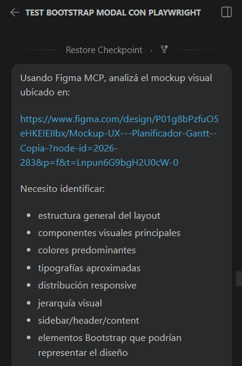
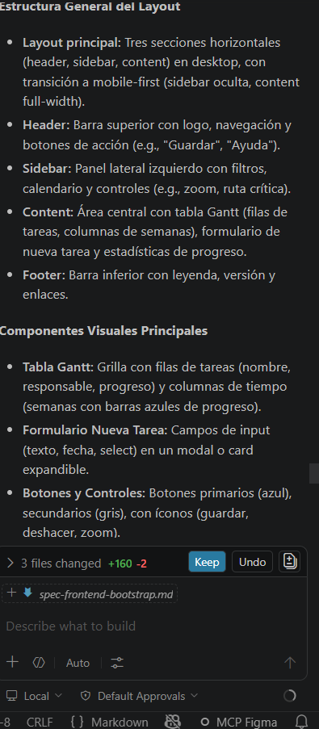

# Especificación Técnica - Desarrollador Frontend / Bootstrap (Spec-Driven Development)

## Descripción

Esta especificación técnica describe la migración del proyecto **Planix** a un diseño responsive utilizando Bootstrap 5, manteniendo la coherencia visual con los estilos existentes (`styles.css`, `components.css`, `responsive.css`).

Se aplica la metodología **Spec-Driven Development (SDD)**, donde esta especificación se redacta antes de realizar cambios en el código.

---

## ¿Qué se hará?

Como responsable del rol **Desarrollador Frontend / Bootstrap**, se realizarán las siguientes tareas:

### 1. Instalación de Bootstrap

* Se instalará Bootstrap 5 mediante CDN (jsDelivr)
* Se integrará sin eliminar los estilos existentes
* Se verificará compatibilidad con CSS actual

### 2. Migración a sistema de columnas

Se migrarán las siguientes secciones:

* Layout principal (`main`)
* Sidebar lateral
* Header
* Toolbar
* Sección de descripción
* Formulario de nueva tarea
* Contenedor del Gantt

Se utilizarán:

* `container-fluid`
* `row`
* `col`

### 3. Creación de archivo de overrides

Se creará el archivo:

```
css/bootstrap-overrides.css
```

Para:

* Definir colores institucionales (#0f49bd, #f6f6f8)
* Ajustar tipografía
* Corregir conflictos con Bootstrap
* Mantener identidad visual

### 4. Evaluación de estilos existentes

* No se eliminarán estilos previos
* Se modificarán solo en caso de conflicto
* Se prioriza mantener la estética original del proyecto

---

## ¿Por qué?

La implementación de Bootstrap permite:

* Mejorar la responsividad en distintos dispositivos
* Estandarizar el layout del proyecto
* Reducir complejidad de CSS custom
* Facilitar mantenimiento futuro

---

## Criterios de Aceptación

* [x] Bootstrap instalado correctamente
* [x] Sistema de grillas aplicado en el layout principal
* [x] No se rompen estilos existentes
* [x] Archivo `bootstrap-overrides.css` implementado
* [x] Coherencia visual mantenida con el mockup
* [x] Sitio responsive en mobile, tablet y desktop
* [x] Test case documentado

---

## Implementación

### Instalación de Bootstrap

Se agregó en `index.html`:

```html
<link href="https://cdn.jsdelivr.net/npm/bootstrap@5.3.3/dist/css/bootstrap.min.css" rel="stylesheet">
```

---

### Migración de layout

Se implementó estructura base:

```html
<main class="container-fluid">
  <div class="row">

    <aside class="col-12 col-md-2">
    </aside>

    <div class="col-12 col-md-10">
    </div>

  </div>
</main>
```

---

### Archivo bootstrap-overrides.css

Se creó archivo para:

* Personalización de colores
* Ajustes responsive
* Corrección de conflictos con Bootstrap
* Integración con estilos existentes

---

## Uso de Figma MCP

Debido a limitaciones de cuota en Copilot Agent Mode, el análisis del mockup se realizó manualmente.

### Prompt utilizado

```
Analyze the Figma mockup for the Planix project and prepare Bootstrap responsive layout suggestions based on the design.
Use Bootstrap 5 grid system without breaking existing styles.css, components.css and responsive.css.
```

---

## Testing Responsive

El testing se realizó manualmente utilizando las DevTools de Google Chrome.

### Breakpoints testeados

* Mobile (390x844)
* Tablet (768x1024)
* Desktop (1280x800)

### Resultados

* Layout responsive correcto
* No se detectó scroll horizontal
* Estilos previos se mantienen correctamente
* Bootstrap integrado sin romper diseño

---

## Hallazgos

| # | Elemento | Breakpoint | Descripción             | Severidad |
| - | -------- | ---------- | ----------------------- | --------- |
| 1 | Sidebar  | Mobile     | Se visualiza comprimido | Baja      |

---

## Issues generados

* Issue #55: Corrección de sidebar responsive

---

## Ajustes realizados

* Corrección de sidebar en mobile mediante media query
* Ajustes de padding y layout
* Optimización visual para dispositivos pequeños

---

## Riesgos y mitigaciones

* **Riesgo:** Conflicto entre Bootstrap y CSS existente
  **Mitigación:** Uso de `bootstrap-overrides.css`

* **Riesgo:** Problemas de layout en mobile
  **Mitigación:** Testing responsive y fixes incrementales

---

## Responsabilidades adicionales

* Coordinar con el Especialista en Componentes Bootstrap
* Mantener coherencia visual del proyecto
* Documentar cambios en changelog.md

---

## Uso de Figma MCP

Se realizó un análisis asistido mediante Figma MCP sobre el mockup visual del proyecto ubicado en Figma.

Objetivo:
- validar estructura general del layout
- identificar componentes Bootstrap compatibles
- extraer paleta visual y jerarquía visual
- verificar comportamiento responsive esperado

Tool call utilizado:
- análisis visual del mockup mediante Figma MCP
- extracción de estructura y componentes
- identificación de colores y tipografías

Prompt utilizado:


Output principal obtenido:
- layout compuesto por header + sidebar + content principal
- tabla Gantt como componente central
- sidebar responsive con comportamiento offcanvas en mobile
- uso predominante de tonos azules, grises claros y fondos neutros
- tipografía sans-serif moderna alineada con Bootstrap
- uso compatible con Bootstrap Grid (`container-fluid`, `row`, `col-*`)
- presencia de componentes equivalentes a Navbar, Modal, Offcanvas, Table y Progress



Decisiones tomadas a partir del análisis:
- utilización de Bootstrap 5.3
- implementación de layout responsive basado en Grid System
- uso de `bootstrap-overrides.css` para preservar identidad visual
- adaptación del sidebar responsive para mobile/tablet
- incorporación de componentes Bootstrap equivalentes al mockup

---

## Conclusión

La migración a Bootstrap se implementó correctamente, mejorando la responsividad del proyecto sin afectar la identidad visual existente. Se logró una integración progresiva y controlada, cumpliendo con los objetivos planteados en el plan del proyecto.

---

## Referencias
* Documentación del repositorio
* Documentación oficial de Bootstrap
