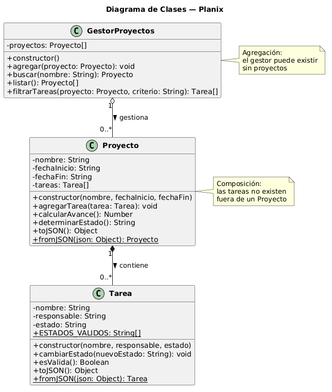

# Diagrama de Clases — Planix

## Diagrama

[📄 Ver archivo .puml editable](./diagrama-clases.puml)

---

## Descripción de cada clase

### Tarea

Representa una unidad de trabajo dentro de un proyecto.
Encapsula la validación de estados y garantiza que solo
se asignen valores válidos ("pendiente", "en curso", "completada").

### Proyecto

Gestiona su ciclo de vida completo: fechas, tareas y avance.
Calcula el porcentaje de completitud y determina si está
en curso, atrasado o finalizado comparando con la fecha actual.

### GestorProyectos

Colección de proyectos de la aplicación. Centraliza las
operaciones de búsqueda y filtrado. Actúa como punto de
entrada único para el controlador (script.js).

---

## Relaciones

| Relación                   | Tipo               | Descripción                                |
| -------------------------- | ------------------ | ------------------------------------------ |
| GestorProyectos → Proyecto | Agregación (o--)   | El gestor puede existir sin proyectos      |
| Proyecto → Tarea           | Composición (\*--) | Las tareas no existen fuera de un proyecto |

---

## Decisiones de diseño

- **¿Por qué composición Proyecto→Tarea?**
  Una Tarea sin Proyecto carece de sentido en el dominio del Gantt.
  Si se elimina un Proyecto, sus tareas se eliminan con él.

- **¿Por qué agregación GestorProyectos→Proyecto?**
  El gestor es la colección; los proyectos pueden existir
  conceptualmente sin un gestor específico.

- **¿Por qué toJSON/fromJSON en cada clase?**
  Permite serializar las instancias para guardarlas en
  localStorage via StorageUtil y reconstruirlas al cargar la app.

---

## Instrucciones para editar

**VS Code:** Instalar "PlantUML" de jebbs → Alt+D para preview
**Online:** [plantumleditor.com](https://www.plantumleditor.com)
