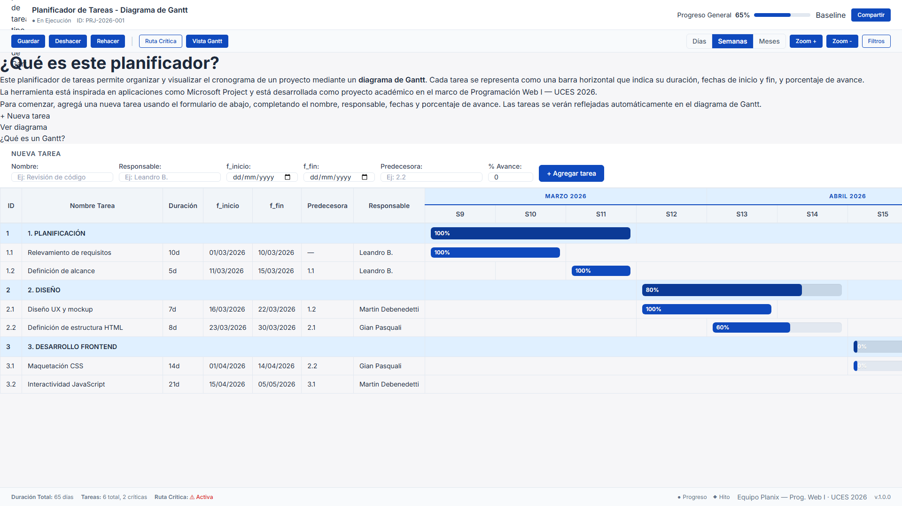
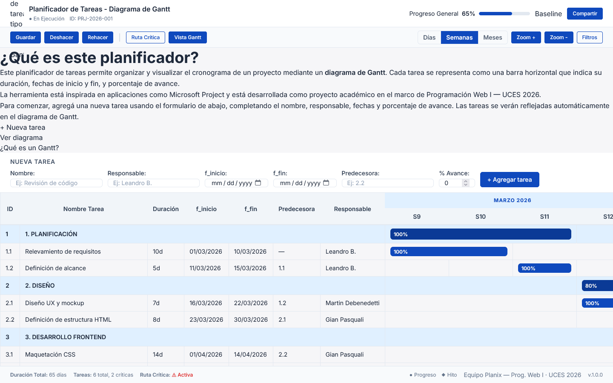
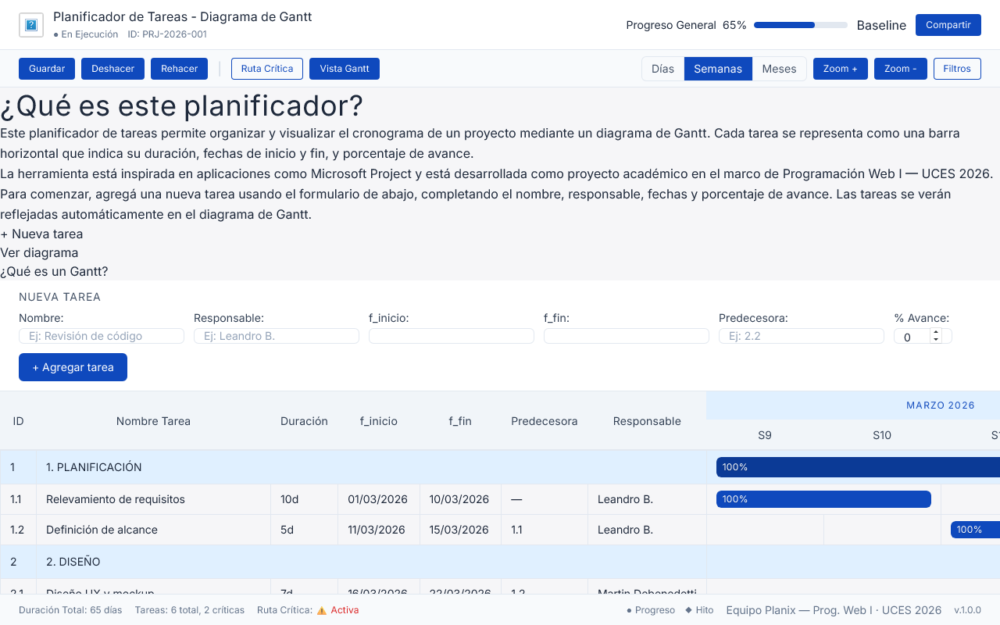
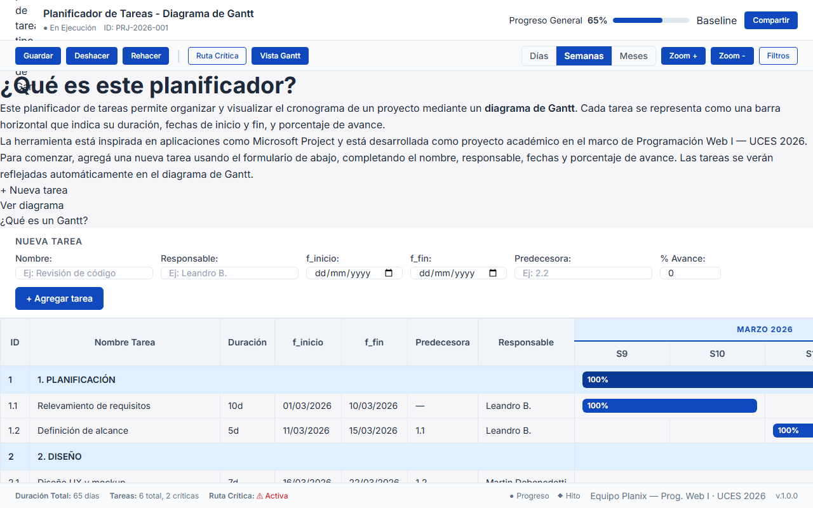
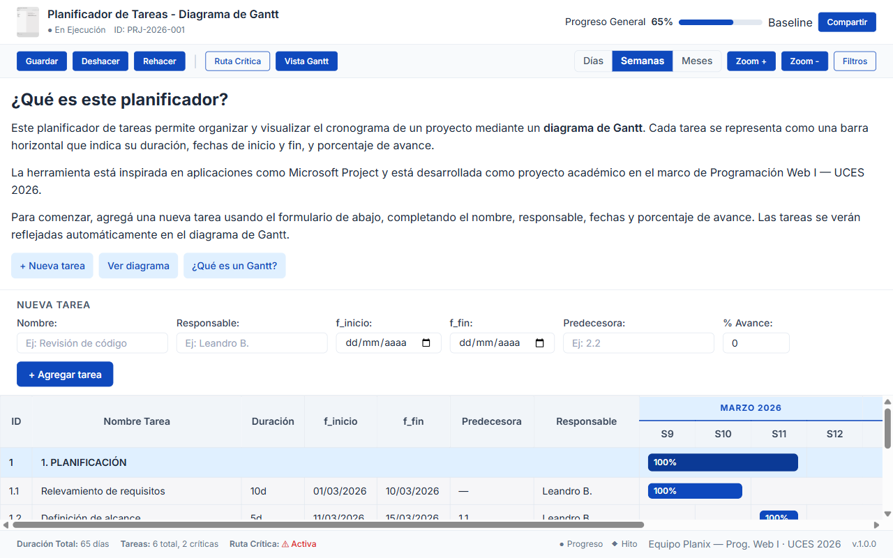

# Test Case 1 — Compatibilidad Visual en Navegadores Desktop

## Metadata
| Campo | Valor |
|-------|-------|
| Responsable | Leandro Berro |
| Fecha Momento 1 | 05/04/2026 |
| Fecha Momento 2 | 13/04/2026 |
| Rama Momento 1 | `feature/dev-frontend-css-add-styles` |
| Rama Momento 2 | `develop` |
| URL testeada | `http://127.0.0.1:3000/index.html` |

## Objetivo
Verificar que la página se visualiza correctamente en distintos viewports desktop, sin elementos cortados, desbordados o ilegibles.

## Herramientas utilizadas
- Playwright MCP (`@playwright/mcp`)
- GitHub Copilot Agent Mode
- Live Preview / internal server
- Capturas de pantalla generadas durante la ejecución

---

## Prompt para Copilot Agent Mode

Copiá este prompt en Copilot Agent Mode con Playwright MCP activo:

```text
Usando Playwright MCP, necesito testear la compatibilidad visual de mi página
en distintos viewports desktop. La URL es http://127.0.0.1:3000/index.html

Ejecutá estos pasos en orden:

1. Navegá a la URL y esperá que la página cargue completamente.

2. Configurá el viewport en 1920x1080 (Chrome) y:
   - tomá una captura de pantalla completa
   - verificá que el header con la navegación sea visible y no se corte
   - verificá que las secciones principales estén visibles y alineadas correctamente
   - verificá que no haya overflow horizontal
   - verificá que el footer muestre el texto y los links correctamente

3. Configurá el viewport en 1440x900 (Firefox) y repetí la misma revisión.

4. Configurá el viewport en 1280x800 (Safari/macOS) y repetí la misma revisión.

5. Configurá el viewport en 1280x800 (Edge) y repetí la misma revisión.

6. Para cada viewport, reportá si encontrás:
   - elementos cortados
   - desbordes horizontales
   - problemas de alineación
   - jerarquía visual deficiente
   - footer o navegación mal renderizados

7. Generá un resumen final con el estado de cada viewport:
   - OK
   - Con problemas

8. No modifiques archivos del repositorio.
Solo reportá hallazgos y confirmá si las capturas se generaron correctamente.
```
---

## MOMENTO 1 — Pre-merge (rama `feature/dev-frontend-css-add-styles`)

### Viewports testeados
| Viewport | Navegador simulado |	Navegación	| Layout general | Tabla / Gantt | Footer | Estado |
|:---:|:---:|:---:|:---:|:---:|:---:|:---:|
| 1920×1080 | Chrome | OK | OK |	Con problemas | OK |	Con observaciones|
|1440×900 |	Firefox | OK |	OK	| Con problemas | OK |	Con observaciones |
|1280×800 |	Safari/macOS |	OK	| OK | Con problemas	| OK| Con observaciones
|1280×800 |	Edge | OK |	OK	| Con problemas | OK	| Con observaciones |

### Capturas de pantalla

| Viewport| Captura | Estado |
|:---:|:---:|:---:|
| 1920×1080 |  | Con observaciones |
| 1440×900 |  | Con observaciones |
| 1280×800 Safari/macOS |  | Con observaciones |
| 1280×800 Edge |  | Con observaciones |

### Hallazgos
| # | Elemento | Viewport afectado | Descripción |	Severidad |
|:---:|:---:|:---:|:---:|:---:|
| 1 |	Tabla Gantt	| 1920×1080, 1440×900, 1280×800 | La tabla Gantt presenta desborde horizontal en todos los viewports desktop testeados y requiere scroll lateral para visualizar todas las columnas de semanas. El ancho relevado por el test fue de 2405 px, superior al ancho disponible en todos los viewports evaluados. | Media |

### Resultado Momento 1

- [ ] ✅ PASS — Sin hallazgos 

- [x] ⚠️ FAIL CON OBSERVACIONES

- [ ] ❌ FAIL


### Resumen Momento 1

La página se visualiza correctamente en términos generales en los cuatro viewports desktop probados. El header, la navegación, la sección “¿Qué es este planificador?”, el formulario “Nueva Tarea” y el footer se renderizan adecuadamente. El hallazgo principal corresponde al desborde horizontal de la tabla Gantt, que requiere scroll lateral para visualizar la totalidad de sus columnas.

---

## MOMENTO 2 — Post-merge (`develop`)

### Viewports testeados

| Viewport | Navegador simulado | Navegación | Layout general | Tabla / Gantt | Footer | Estado | 
|:---:|:---:|:---:|:---:|:---:|:---:|:---:|
| 1920×1080 | OK | OK | OK | OK | OK |
| 1440×900 | OK | OK | OK | OK | OK |
| 1280×800 | OK | OK | OK | OK | OK |

### Capturas de pantalla

| Viewport | Captura | Estado |
|:---:|:---:|:---:|
| 1920×1080 |  | OK |
| 1440×900 |  | OK |
| 1280×800 |  | OK |

### Hallazgos
| # | Elemento | Viewport afectado | Descripción | Severidad |
|:---:|:---:|:---:|:---:|:---:|
| - | - | - | No se detectaron hallazgos relevantes. El issue #28 quedó resuelto en la integración final. | - |

### Resultado Momento 2

- [x] ✅ PASS — Sin hallazgos
- [ ] ⚠️ FAIL CON OBSERVACIONES
- [ ] ❌ FAIL

### Resumen Momento 2

En los tres viewports desktop evaluados no se detectaron desbordes horizontales, textos cortados, problemas de navegación, layout ni footer. Se verificó que el issue #28 quedó resuelto y que la tabla Gantt se adapta correctamente en la integración final.


### Issues creados

| Issue | Momento | Elemento | Severidad | Estado |
|:---:|:---:|:---:|:---:|:---:|
| [#28](https://github.com/martindebenedetti/Planix/issues/28) | Momento 1 | Tabla Gantt | Media | Cerrado y verificado como resuelto en Momento 2 |

### Conclusión general

**Resultado final:** PASS — Sin hallazgos

Durante el Momento 1 se detectó un desborde horizontal de la tabla Gantt, documentado en el issue [#28](https://github.com/martindebenedetti/Planix/issues/28). En el Momento 2, ya con todas las features integradas en `develop`, se verificó que dicho hallazgo quedó resuelto y que la compatibilidad visual desktop es correcta en los viewports evaluados.