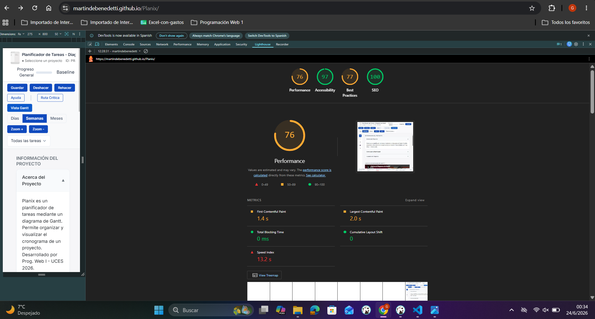
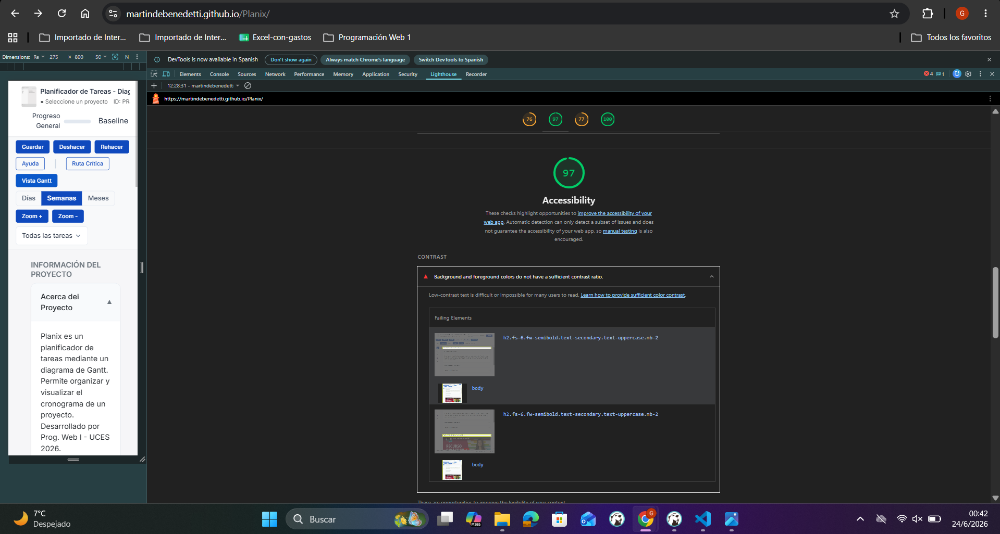

# Test Case 11: Auditoría Lighthouse - Baseline Inicial

## Información General
- **Fecha de ejecución:** 24 de junio de 2026
- **URL testeada:** Localhost (https://martindebenedetti.github.io/Planix/)
- **Rama:** `develop` (antes de feature branches del parcial)
- **Navegador:** Chrome 149.0.0.0

## Umbrales Mínimos Definidos
- **Performance:** >= 80
- **Accessibility:** >= 90
- **Best Practices:** >= 85
- **SEO:** >= 80

## Resultados Obtenidos

### Performance: 76 ⚠️ (Por debajo del umbral)
- First Contentful Paint: 1.4 s
- Largest Contentful Paint: 2.0 s
- Total Blocking Time: 0 ms
- Cumulative Layout Shift: 0
- Speed Index: 13.2 s

### Accessibility: 96 ✅
- Contraste insuficiente: Algunos textos en primer plano no tienen suficiente ratio de contraste con su fondo.

### Best Practices: 77 ⚠️
- Uso de cookies de terceros vinculadas a iframes/recursos externos (YouTube).
- Faltan cabeceras de seguridad estrictas (CSP, HSTS).

### SEO: 100 ✅
- Excelente. Cumple con todos los estándares de indexabilidad y etiquetas semánticas.

## Issues Generadas
- [#125] **[Performance]** Optimizar y redimensionar `diseño-inicial.png`: La imagen se carga en 1440x2000px pero se renderiza a 32x44px, penalizando el LCP y el ancho de banda.
- [#126] **[Accessibility]** Corregir ratio de contraste de colores en la interfaz gráfica para cumplir con el estándar WCAG.

## Conclusiones
La aplicación actual, refactorizada en la Cuarta Entrega hacia una arquitectura de Eventos y POO, demuestra una Accesibilidad y SEO sobresalientes. Sin embargo, el puntaje de Performance inicial (76) se encuentra por debajo del umbral mínimo exigido (80), penalizado principalmente por la carga de recursos gráficos no redimensionados (`diseño-inicial.png`). Estas métricas servirán como línea base (baseline) para validar que la próxima integración asíncrona (Fetch API) y de librerías externas (SweetAlert2) no degrade la calidad de la experiencia, mientras el equipo de desarrollo soluciona la issue #125 para alcanzar el umbral de aprobación.
