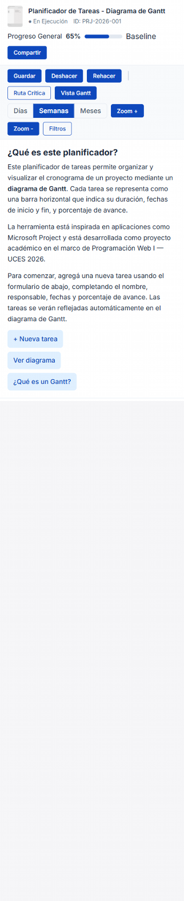
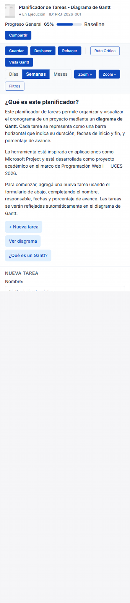
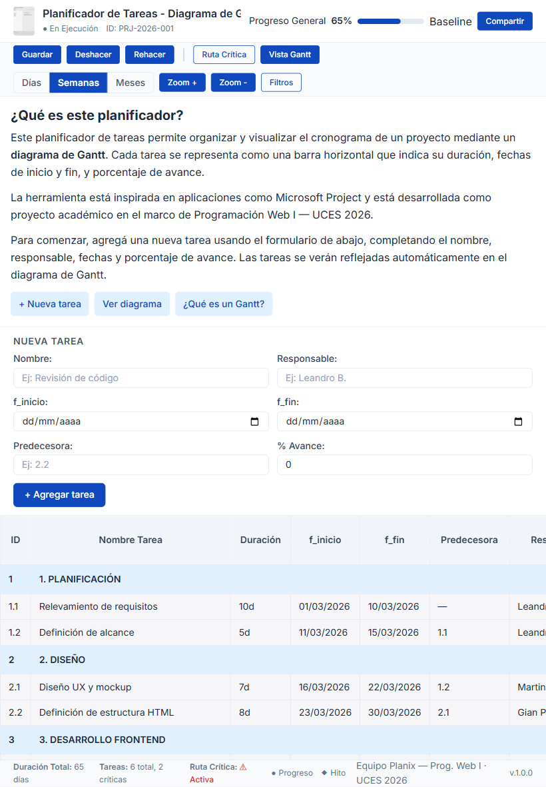

# Test Case 2 — Responsive en Dispositivos Móviles

## Metadata
| Campo | Valor |
|-------|-------|
| Responsable | Leandro Berro |
| Fecha Momento 1 | 12/04/2026 |
| Fecha Momento 2 | 13/04/2026 |
| Rama Momento 1 | `feature/responsive-design-add-responsive-styles` |
| Rama Momento 2 | `develop` |
| URL testeada | `http://127.0.0.1:3000/index.html` |

## Objetivo
Verificar que el diseño responsive funciona correctamente en móviles y tablets, sin desbordamientos ni scroll horizontal involuntario.

## Herramientas utilizadas
- Playwright MCP (`@playwright/mcp`) con viewport emulation
- GitHub Copilot Agent Mode
- Live Preview / internal server

---

## Prompt para Copilot Agent Mode

Copiá este prompt en Copilot Agent Mode con Playwright MCP activo:

```text
Usá Playwright MCP en este workspace.

No escribas scripts.
No uses require.
No uses import.
No modifiques archivos del repositorio.

Abrí la página del preview local.
Redimensioná la ventana a 390x844 y tomá una captura completa.
Indicá si hay overflow horizontal, texto cortado, elementos superpuestos, problemas en menú o botones y si el formulario ocupa correctamente el ancho disponible.

Repetí el mismo proceso para:
- 412x915
- 820x1180
```

---

## MOMENTO 1 — Pre-merge (rama `feature/responsive-design-add-responsive-styles`)

### Dispositivos testeados
| Dispositivo | Viewport | Navegación | Layout móvil | Tabla | Formulario | Scroll horizontal | Estado |
|-------------|----------|------------|--------------|-------|------------|-------------------|--------|
| iPhone 14 Pro | 390×844 | OK | OK | OK | OK | No | OK |
| Samsung Galaxy S23 | 412×915 | OK | OK | OK | OK | No | OK |
| iPad Air | 820×1180 | OK | OK | OK | OK | No | OK |

### Capturas de pantalla
| Dispositivo | Captura | Estado |
|-------------|---------|--------|
| iPhone 14 Pro |  | OK |
| Samsung Galaxy S23 |  | OK |
| iPad Air |  | OK |

### Hallazgos
| # | Elemento | Dispositivo afectado | Descripción | Desbordamiento | Severidad |
|---|----------|----------------------|-------------|----------------|-----------|
| - | - | - | No se detectaron hallazgos relevantes de responsive en los dispositivos analizados. | - | - |

### Resultado Momento 1
- [x] ✅ PASS — Sin hallazgos
- [ ] ⚠️ FAIL CON OBSERVACIONES
- [ ] ❌ FAIL

### Resumen Momento 1
La rama `feature/responsive-design-add-responsive-styles` respondió correctamente en los tres dispositivos evaluados. No se detectaron problemas de overflow horizontal, texto cortado, superposición de elementos ni fallas de adaptación en menú, botones o formulario. En consecuencia, no corresponde crear issue para este test case en el Momento 1.

---

## MOMENTO 2 — Post-merge (`develop`)

### Dispositivos testeados
| Dispositivo | Viewport | Navegación | Layout móvil | Tabla | Formulario | Scroll horizontal | Estado |
|-------------|----------|------------|--------------|-------|------------|-------------------|--------|
| iPhone 14 Pro | 390×844 | OK | OK | OK | OK | No | OK |
| Samsung Galaxy S23 | 412×915 | OK | OK | OK | OK | No | OK |
| iPad Air | 820×1180 | OK | OK | OK | OK | No | OK |

### Capturas de pantalla
| Dispositivo | Captura | Estado |
|-------------|---------|--------|
| iPhone 14 Pro |  | OK |
| Samsung Galaxy S23 |  | OK |
| iPad Air |  | OK |

### Hallazgos
| # | Elemento | Dispositivo afectado | Descripción | Desbordamiento | Severidad |
|---|----------|----------------------|-------------|----------------|-----------|
| - | - | - | No se detectaron hallazgos relevantes de responsive en la integración final. | - | - |

### Resultado Momento 2
- [x] ✅ PASS — Sin hallazgos
- [ ] ⚠️ FAIL CON OBSERVACIONES
- [ ] ❌ FAIL

### Resumen Momento 2
El diseño responsive se comportó correctamente en los tres dispositivos evaluados. No se detectaron problemas de overflow horizontal, texto cortado, superposición de elementos ni fallas de adaptación en menú, botones o formulario.

---

## Issues creados
| Issue | Momento | Elemento | Dispositivo | Severidad | Estado |
|-------|---------|----------|-------------|-----------|--------|
| No se generaron issues | Momento 1 | Responsive | iPhone 14 Pro / Samsung Galaxy S23 / iPad Air | - | Sin hallazgos relevantes |
| No se generaron issues | Momento 2 | Responsive | iPhone 14 Pro / Samsung Galaxy S23 / iPad Air | - | Sin hallazgos relevantes |

## Conclusión general
**Resultado final:** PASS — Sin hallazgos

Durante el Momento 1 y el Momento 2, el diseño responsive se comportó correctamente en los dispositivos evaluados. No se detectaron problemas de adaptación relevantes en la integración final. 
