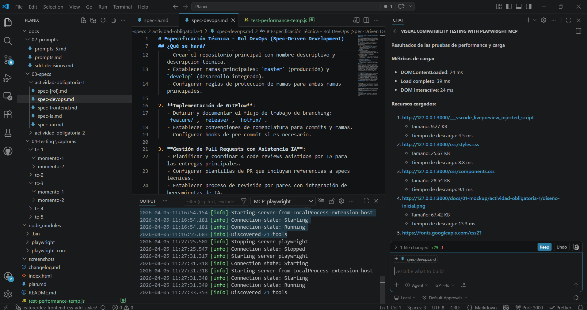

# Test Case 3 — Performance y carga

## Metadata
| Campo | Valor |
|-------|-------|
| Responsable | Leandro Berro |
| Fecha Momento 1 | 05/04/2026 |
| Fecha Momento 2 | Pendiente |
| Rama Momento 1 | `feature/dev-frontend-css-add-styles` |
| Rama Momento 2 | `develop` |
| URL testeada | `http://127.0.0.1:3000/index.html` |

## Objetivo
Medir el comportamiento de carga de la página, relevando métricas básicas de performance y analizando los recursos descargados para detectar posibles problemas de peso o tiempos excesivos.

## Herramientas utilizadas
- Playwright MCP (`@playwright/mcp`)
- GitHub Copilot Agent Mode
- Live Preview / internal server

---

## Prompt para Copilot Agent Mode

Copiá este prompt en Copilot Agent Mode con Playwright MCP activo:

```text
Usá exclusivamente Playwright MCP ya configurado en este workspace.

No instales librerías ni modifiques archivos del repositorio.

Necesito testear performance y carga de:
http://127.0.0.1:3000/index.html

Hacé esto:
1. Abrí la URL y esperá la carga completa.
2. Relevá estas métricas:
   - DOMContentLoaded
   - Load completo
   - DOM Interactive
3. Listá los recursos cargados con tamaño y tiempo de descarga.
4. Indicá si detectás recursos pesados o tiempos llamativos.
5. Devolveme un resumen claro con resultados y hallazgos.
```

## MOMENTO 1 — Pre-merge (rama `feature/dev-frontend-css-add-styles`)

### Métricas relevadas
| Métrica | Valor |
|---|---|
| DOMContentLoaded | 24 ms |
| Load completo | 39 ms |
| DOM Interactive | 24 ms |

### Recursos cargados
| Recurso | Tamaño | Tiempo de descarga |
|---|---:|---:|
| `http://127.0.0.1:3000/___vscode_livepreview_injected_script` | 9.27 KB | 4.5 ms |
| `http://127.0.0.1:3000/css/styles.css` | 25.67 KB | 8.8 ms |
| `http://127.0.0.1:3000/css/components.css` | 28.54 KB | 9.1 ms |
| `http://127.0.0.1:3000/docs/01-mockup/actividad-obligatoria-1/diseño-inicial.png` | 67.42 KB | 13.3 ms |
| `https://fonts.googleapis.com/css2?family=Inter:wght@400;500;600;700&display=swap` | 0.74 KB | 0 ms |
| `https://fonts.gstatic.com/s/inter/v20/UcC73FwrK3iLTeHuS_nVMrMxCp50SjIa1ZL7.woff2` | 48.26 KB | 0 ms |

### Capturas de pantalla
| Evidencia | Captura | Estado |
|---|---|---|
| Resultado del análisis de performance |  | OK |
| Vista general de la página durante la prueba | Pendiente / No agregada | No agregada |

### Hallazgos
| # | Elemento | Descripción | Severidad |
|---|---|---|---|
| - | - | No se detectaron problemas significativos de performance o carga. | - |

### Resultado Momento 1
- [x] ✅ PASS — Sin hallazgos
- [ ] ⚠️ FAIL CON OBSERVACIONES
- [ ] ❌ FAIL

### Resumen Momento 1
La página cargó rápidamente y presentó métricas de carga muy bajas. No se detectaron problemas significativos en DOMContentLoaded, Load completo ni DOM Interactive. Los recursos cargados muestran tamaños y tiempos de descarga razonables. El recurso más pesado fue `diseño-inicial.png`, pero su tiempo de descarga se mantuvo dentro de valores aceptables.

### Issues creados
| Issue | Momento | Elemento | Severidad | Estado |
|---|---|---|---|---|
| No se generaron issues | Momento 1 | Performance y carga | - | Sin hallazgos relevantes |

---

## MOMENTO 2 — Post-merge (`develop`)

### Métricas relevadas
| Métrica | Valor |
|---|---|
| DOMContentLoaded | Pendiente |
| Load completo | Pendiente |
| DOM Interactive | Pendiente |

### Recursos cargados
| Recurso | Tamaño | Tiempo de descarga |
|---|---:|---:|
| Pendiente | Pendiente | Pendiente |

### Capturas de pantalla
| Evidencia | Captura | Estado |
|---|---|---|
| Resultado del análisis de performance | `capturas/tc-3/momento-2/` | Pendiente |
| Vista general de la página durante la prueba | `capturas/tc-3/momento-2/` | Pendiente |

### Hallazgos
| # | Elemento | Descripción | Severidad |
|---|---|---|---|
| - | - | Pendiente de ejecución en `develop`. | - |

### Resultado Momento 2
- [ ] ✅ PASS — Sin hallazgos
- [ ] ⚠️ FAIL CON OBSERVACIONES
- [ ] ❌ FAIL

### Issues creados
| Issue | Momento | Elemento | Severidad | Estado |
|---|---|---|---|---|
| No se generaron issues | Momento 1 | Performance y carga | - | Sin hallazgos relevantes |

## Conclusión general

**Resultado final:** PASS — Sin hallazgos

Durante el Momento 1 sobre la rama `feature/dev-frontend-css-add-styles`, la página presentó un comportamiento de carga rápido y estable. No se detectaron problemas significativos de performance ni recursos con tiempos de descarga preocupantes. El caso deberá repetirse en el Momento 2 sobre `develop` para validar la integración final.
