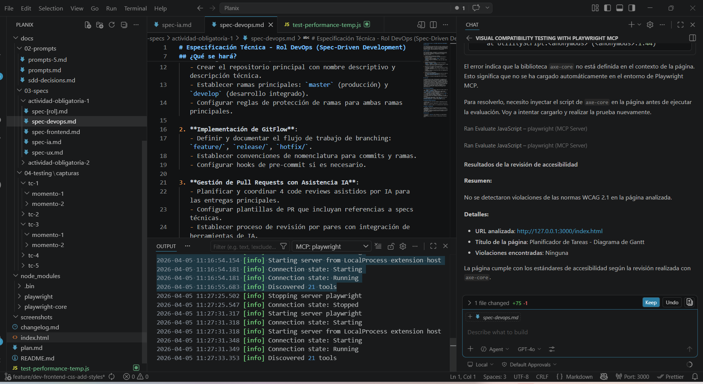
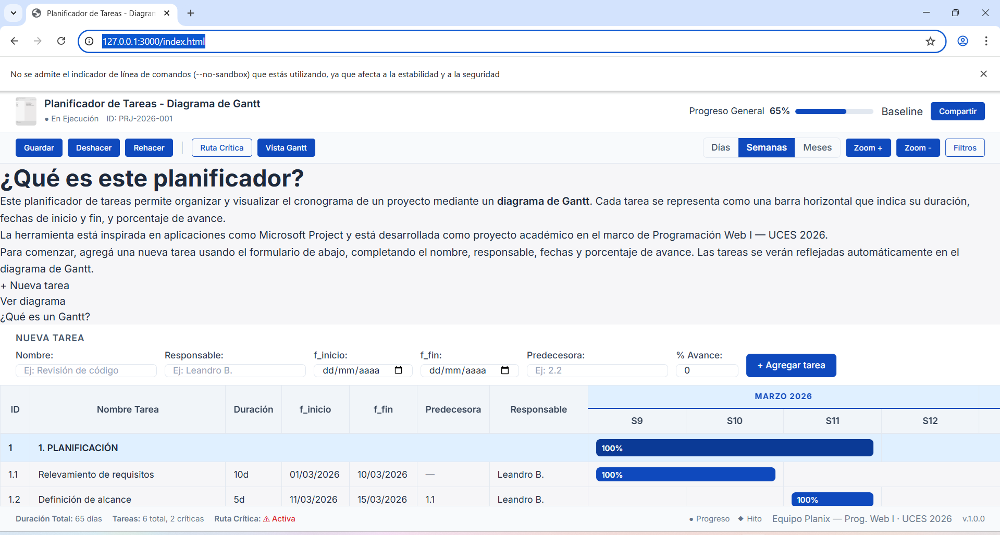

# Test Case 4 — Accesibilidad Web (axe-core)

## Metadata
| Campo | Valor |
|-------|-------|
| Responsable | Leandro Berro |
| Fecha Momento 1 | 05/04/2026 |
| Fecha Momento 2 | Pendiente |
| Rama Momento 1 | `feature/dev-frontend-css-add-styles` |
| Rama Momento 2 | `develop` |
| URL testeada | `http://127.0.0.1:3000/index.html` |

## Objetivo
Detectar violaciones de accesibilidad WCAG 2.1 mediante análisis automatizado con axe-core, identificando elementos que impidan el acceso a usuarios con discapacidades.

## Herramientas utilizadas
- Playwright MCP (`@playwright/mcp`) con revisión de accesibilidad basada en axe-core
- GitHub Copilot Agent Mode

---

## Prompt para Copilot Agent Mode

```text
Usá exclusivamente Playwright MCP ya configurado en este workspace.

No instales librerías.
No modifiques archivos del repositorio.

Necesito testear accesibilidad web de:
http://127.0.0.1:3000/index.html

Hacé esto:
1. Abrí la URL y esperá la carga completa.
2. Ejecutá una revisión de accesibilidad con axe-core.
3. Reportá violaciones WCAG 2.1 agrupadas por impacto:
   - critical
   - serious
   - moderate
   - minor
4. Para cada hallazgo indicá:
   - regla axe
   - elemento afectado
   - descripción breve del problema
5. Si no hay hallazgos, decímelo explícitamente.
6. Generá un resumen final claro.
7. No uses rutas alternativas ni modifiques archivos.
```

---

## MOMENTO 1 — Pre-merge (rama `feature/dev-frontend-css-add-styles`)

### Resultado del análisis
| Campo | Valor |
|---|---|
| URL analizada | `http://127.0.0.1:3000/index.html` |
| Título de la página | `Planificador de Tareas - Diagrama de Gantt` |
| Violaciones encontradas | Ninguna |

### Impacto por nivel
| Nivel | Resultado |
|---|---|
| critical | Ninguna |
| serious | Ninguna |
| moderate | Ninguna |
| minor | Ninguna |

### Elementos afectados
No aplica.

### Reglas axe afectadas
No aplica.

### Capturas de pantalla
| Evidencia | Captura | Estado |
|---|---|---|
| Resultado del análisis de accesibilidad |  | ok |
| Vista general de la página durante la prueba |  | ok |


### Hallazgos
| # | Regla axe | Elemento afectado | Descripción | Impacto |
|---|---|---|---|---|
| - | - | - | No se detectaron violaciones de accesibilidad WCAG 2.1. | - |

### Resultado Momento 1
- [x] ✅ PASS — Sin hallazgos
- [ ] ⚠️ FAIL CON OBSERVACIONES
- [ ] ❌ FAIL

### Resumen Momento 1
La revisión de accesibilidad realizada sobre la rama `feature/dev-frontend-css-add-styles` no detectó violaciones WCAG 2.1 en la página analizada. En consecuencia, no corresponde crear issue para este test case en el Momento 1.

---

## MOMENTO 2 — Post-merge (`develop`)

### Resultado del análisis
| Campo | Valor |
|---|---|
| URL analizada | Pendiente |
| Título de la página | Pendiente |
| Violaciones encontradas | Pendiente |

### Impacto por nivel
| Nivel | Resultado |
|---|---|
| critical | Pendiente |
| serious | Pendiente |
| moderate | Pendiente |
| minor | Pendiente |

### Elementos afectados
Pendiente.

### Reglas axe afectadas
Pendiente.

### Capturas de pantalla
| Evidencia | Captura | Estado |
|---|---|---|
| Resultado del análisis de accesibilidad | `capturas/tc-4/momento-2/` | Pendiente |
| Vista general de la página durante la prueba | `capturas/tc-4/momento-2/` | Pendiente |

### Hallazgos
| # | Regla axe | Elemento afectado | Descripción | Impacto |
|---|---|---|---|---|
| - | - | - | Pendiente de ejecución en `develop`. | - |

### Resultado Momento 2
- [ ] ✅ PASS — Sin hallazgos
- [ ] ⚠️ FAIL CON OBSERVACIONES
- [ ] ❌ FAIL

### Issues creados
| Issue | Momento | Elemento | Severidad | Estado |
|---|---|---|---|---|
| No se generaron issues | Momento 1 | Accesibilidad | - | Sin hallazgos relevantes |

## Conclusión general

**Resultado final:** PASS — Sin hallazgos

Durante el Momento 1 sobre la rama `feature/dev-frontend-css-add-styles`, no se detectaron violaciones de accesibilidad WCAG 2.1 mediante la revisión realizada con Playwright MCP y axe-core. El caso deberá repetirse en el Momento 2 sobre `develop` para confirmar el comportamiento tras la integración completa.
