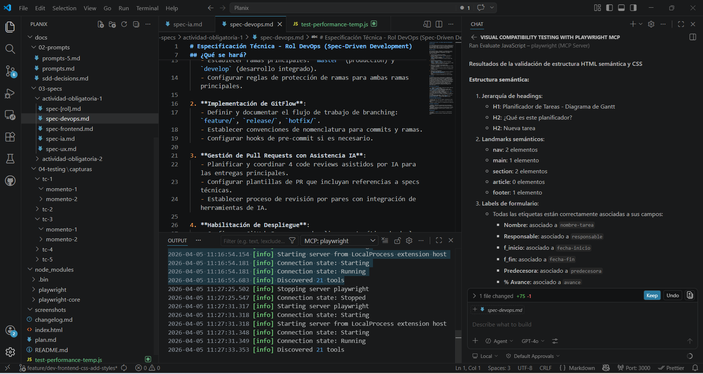

# Test Case 5 — Validación de estructura HTML semántica y CSS

## Metadata
| Campo | Valor |
|-------|-------|
| Responsable | Leandro Berro |
| Fecha Momento 1 | 05/04/2026 |
| Fecha Momento 2 | Pendiente |
| Rama Momento 1 | `feature/dev-frontend-css-add-styles` |
| Rama Momento 2 | `develop` |
| URL testeada | `http://127.0.0.1:3000/index.html` |

## Objetivo
Validar la estructura HTML semántica del sitio, la correcta asociación entre labels y campos del formulario y la carga de los archivos CSS principales relacionados con la rama evaluada.

## Herramientas utilizadas
- Playwright MCP (`@playwright/mcp`)
- GitHub Copilot Agent Mode
- Revisión estructural/semántica de HTML
- Revisión de carga de archivos CSS

---

## Prompt para Copilot Agent Mode

Copiá este prompt en Copilot Agent Mode con Playwright MCP activo:

```text
Usá exclusivamente Playwright MCP ya configurado en este workspace.

No instales librerías.
No modifiques archivos del repositorio.

Necesito validar la estructura HTML semántica y CSS de:
http://127.0.0.1:3000/index.html

Hacé esto:
1. Abrí la URL y esperá la carga completa.
2. Revisá la estructura semántica de la página e indicá:
   - jerarquía de headings (h1, h2, h3, etc.)
   - presencia de landmarks semánticos: nav, main, section, article, footer
   - si las labels del formulario están correctamente asociadas a sus campos
3. Indicá si encontrás problemas estructurales o semánticos.
4. Revisá si se cargan correctamente los archivos CSS:
   - css/styles.css
   - css/components.css
   - css/responsive.css
5. Si podés validar HTML y CSS, reportá hallazgos.
6. Si no podés validar contra W3C desde este entorno, decímelo explícitamente y devolvé al menos la revisión estructural/semántica.
7. No uses rutas alternativas ni modifiques archivos.
```

---

## MOMENTO 1 — Pre-merge (rama `feature/dev-frontend-css-add-styles`)

### Estructura semántica

#### Jerarquía de headings
- H1: `Planificador de Tareas - Diagrama de Gantt`
- H2: `¿Qué es este planificador?`
- H2: `Nueva tarea`

#### Landmarks semánticos detectados
- `nav`: 2 elementos
- `main`: 1 elemento
- `section`: 2 elementos
- `article`: 0 elementos
- `footer`: 1 elemento

### Labels de formulario
Todas las etiquetas están correctamente asociadas a sus campos:
- `Nombre` → `nombre-tarea`
- `Responsable` → `responsable`
- `f_inicio` → `fecha-inicio`
- `f_fin` → `fecha-fin`
- `Predecesora` → `predecesora`
- `% Avance` → `avance`

### Estado de archivos CSS
| Archivo | Estado |
|---|---|
| `css/styles.css` | Cargado correctamente |
| `css/components.css` | Cargado correctamente |
| `css/responsive.css` | No cargado |

### Observaciones
- La jerarquía de headings es adecuada.
- Los landmarks semánticos principales están presentes.
- No se utiliza el elemento `article`, pero esto no constituye por sí solo un problema.
- Las labels del formulario están correctamente asociadas, lo que favorece accesibilidad y semántica.
- El archivo `css/responsive.css` no está cargado en esta rama, pero esto no se considera hallazgo relevante para `feature/dev-frontend-css-add-styles`, ya que el diseño responsive corresponde a una rama/rol específico separado.

### Capturas de pantalla
| Evidencia | Captura | Estado |
|---|---|---|
| Resultado del análisis estructural |    | ok |

### Hallazgos
| # | Elemento | Descripción | Severidad |
|---|---|---|---|
| - | - | No se detectaron problemas estructurales o semánticos relevantes atribuibles a esta rama. | - |

### Resultado Momento 1
- [x] ✅ PASS — Sin hallazgos
- [ ] ⚠️ FAIL CON OBSERVACIONES
- [ ] ❌ FAIL

### Resumen Momento 1
La estructura HTML semántica de la página es correcta y consistente con buenas prácticas básicas. La jerarquía de headings, los landmarks principales y la asociación entre labels y campos del formulario se encuentran bien implementados. Aunque `css/responsive.css` no está cargado, esto se interpreta como parte del alcance pendiente de la rama de responsive y no como un defecto de la rama frontend evaluada.

### Issues creados
| Issue | Momento | Elemento | Severidad | Estado |
|---|---|---|---|---|
| No se generaron issues | Momento 1 | Estructura HTML semántica y CSS | - | Sin hallazgos relevantes |

---

## MOMENTO 2 — Post-merge (`develop`)

### Estructura semántica
Pendiente de ejecución en `develop`.

### Labels de formulario
Pendiente.

### Estado de archivos CSS
| Archivo | Estado |
|---|---|
| `css/styles.css` | Pendiente |
| `css/components.css` | Pendiente |
| `css/responsive.css` | Pendiente |

### Observaciones
Pendiente.

### Capturas de pantalla
| Evidencia | Captura | Estado |
|---|---|---|
| Resultado del análisis estructural | `capturas/tc-5/momento-2/` | Pendiente |
| Vista general de la página y formulario | `capturas/tc-5/momento-2/` | Pendiente |

### Hallazgos
| # | Elemento | Descripción | Severidad |
|---|---|---|---|
| - | - | Pendiente de ejecución en `develop`. | - |

### Resultado Momento 2
- [ ] ✅ PASS — Sin hallazgos
- [ ] ⚠️ FAIL CON OBSERVACIONES
- [ ] ❌ FAIL

### Issues creados
| Issue | Momento | Elemento | Severidad | Estado |
|---|---|---|---|---|
| No se generaron issues | Momento 1 | Estructura HTML semántica y CSS | - | Sin hallazgos relevantes |

## Conclusión general

**Resultado final:** PASS — Sin hallazgos

Durante el Momento 1 sobre la rama `feature/dev-frontend-css-add-styles`, la estructura HTML semántica y la carga de los archivos CSS relevantes para esta rama fueron correctas. No se detectaron problemas estructurales relevantes ni asociaciones incorrectas en el formulario. El caso deberá repetirse en el Momento 2 sobre `develop` para validar la integración final.
