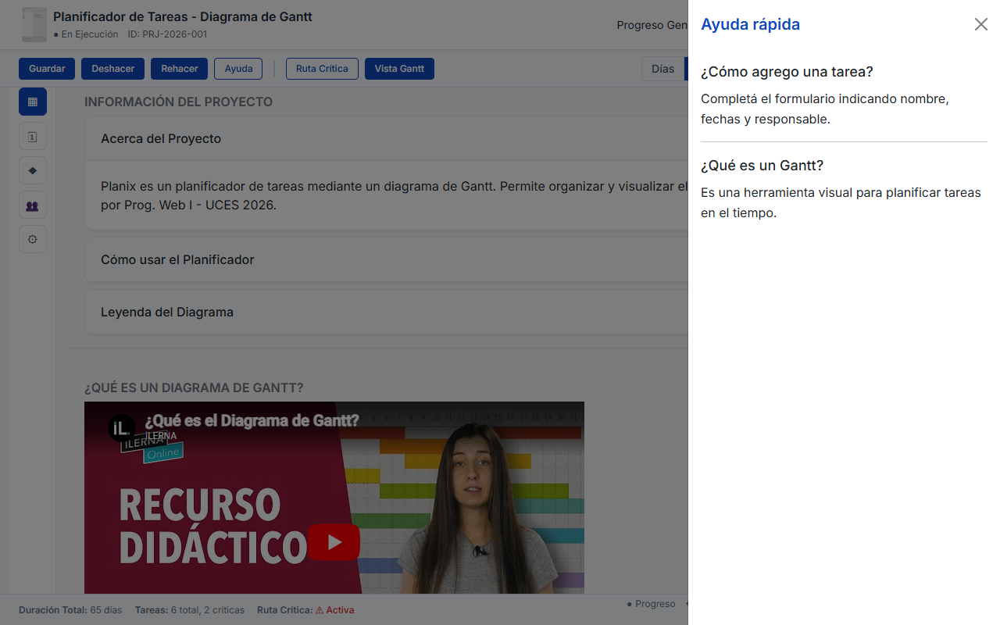
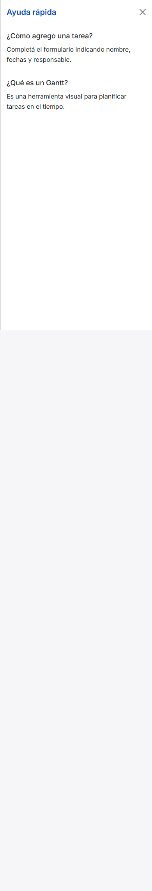
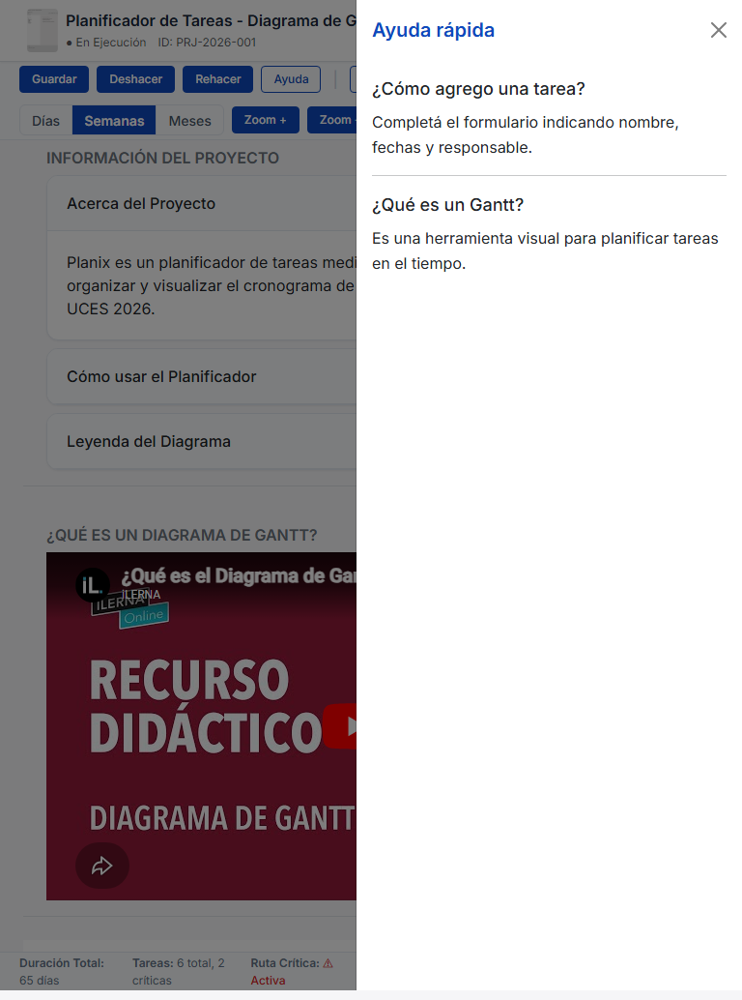

# Test Case 8 — Offcanvas de ayuda Bootstrap

## Metadata
| Campo | Valor |
|-------|-------|
| Responsable | Gian Pasquali |
| Fecha de ejecución | 14/05/2026 |
| Rama testeada | `fix/RC11-Agregar-TC7-TC8` |
| URL testeada | `http://localhost:3000` |
| Versión de Bootstrap | 5.3 (CDN jsDelivr) |

---

## Breakpoints testeados

| TC-ID | Descripción | Precondición | Pasos | Resultado esperado | Resultado actual | Estado | Herramienta |
|------|-------------|--------------|------|-------------------|-----------------|--------|-------------|
| TC-8 | Verificar apertura y cierre del offcanvas de ayuda en desktop | Aplicación ejecutándose en `http://localhost:3000` con Bootstrap 5.3 cargado | 1. Navegar al sitio 2. Viewport 1280x800 3. Localizar `#offcanvasAyuda` 4. Abrir offcanvas 5. Validar overlay y cierre | El offcanvas debe abrirse correctamente con backdrop y cerrarse sin errores | Offcanvas se abre con `.offcanvas-backdrop.show` y cierra correctamente | PASS | playwright_navigate, playwright_screenshot, playwright_assert |
| TC-8 | Verificar adaptación del offcanvas en mobile | Aplicación ejecutándose correctamente | 1. Navegar al sitio 2. Viewport 390x844 3. Repetir apertura/cierre 4. Revisar diseño | El offcanvas debe adaptarse al tamaño móvil conservando funcionalidad y visibilidad | Offcanvas se adapta en mobile, overlay presente y control de cierre funciona | PASS | playwright_navigate, playwright_screenshot, playwright_assert |
| TC-8 | Verificar comportamiento intermedio en tablet | Aplicación ejecutándose correctamente | 1. Navegar al sitio 2. Viewport 768x1024 3. Abrir offcanvas 4. Validar estilo y overlay | El offcanvas debe presentar comportamiento intermedio estable entre mobile y desktop | Offcanvas se presenta correctamente en tablet con transición estable | PASS | playwright_navigate, playwright_screenshot, playwright_assert |
| TC-8 | Verificar aplicación de `bootstrap-overrides.css` en offcanvas | Aplicación ejecutándose correctamente | 1. Abrir offcanvas 2. Revisar estilos CSS cargados 3. Confirmar visual | Los overrides deben aplicarse sobre Bootstrap estándar | `bootstrap-overrides.css` cargado correctamente, identidad visual mantenida | PASS | playwright_assert |

---

## Evidencia generada

### Capturas Playwright
- 
- 
- 
- 
- 
- 

### Evidencia de ejecución MCP
- 
- 

---

## Issues creados
| Issue | Elemento | Breakpoint | Severidad | Estado |
|-------|----------|------------|-----------|--------|
| - | - | - | - | - |

---

## Conclusión general

**Resultado final:** PASS

El componente offcanvas de ayuda es visible y funcional en desktop, mobile e iPad. Las animaciones/transiciones se ejecutan correctamente, el overlay/backdrop se muestra y el cierre del offcanvas funciona. La identidad visual se mantiene y `bootstrap-overrides.css` se carga correctamente durante la interacción.
