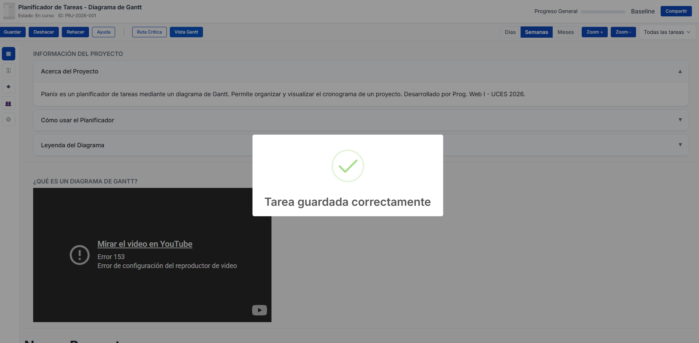
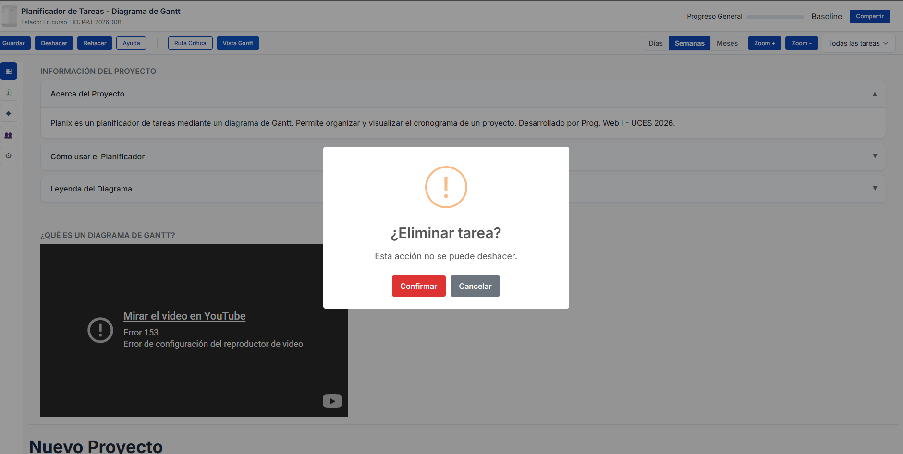

# Documentación de Librería Externa — SweetAlert2

## Información General

- **Nombre:** SweetAlert2
- **Versión:** 11.x
- **Repositorio:** https://github.com/sweetalert2/sweetalert2
- **Documentación oficial:** https://sweetalert2.github.io/

---

## Propósito y Justificación

En la Actividad Obligatoria N°4, Planix fue refactorizado para eliminar completamente el uso de `prompt()` y `alert()` nativos del navegador. Sin embargo, la aplicación quedó sin un mecanismo consistente para dos tipos de interacción con el usuario:

1. **Confirmaciones destructivas:** al eliminar una tarea del diagrama Gantt, la acción debería requerir una confirmación explícita con botones "Confirmar / Cancelar" antes de ejecutarse.
2. **Notificaciones de resultado:** al guardar o agregar una tarea, el usuario necesita feedback visual claro (éxito o error) que tenga un ciclo de vida propio (aparición y desvanecimiento automático).

Se eligió SweetAlert2 porque resuelve ambas necesidades de forma probada y accesible, sin duplicar ninguna funcionalidad implementada con código propio. Implementar modales de confirmación desde cero requeriría manejo de focus trap, roles ARIA y cierre con Escape, lo cual excede el alcance de este rol. SweetAlert2 devuelve una `Promise` que se integra de forma natural con el flujo `async/await` del controlador, y cumple con los estándares de accesibilidad WCAG 2.1 sin configuración adicional.

---

## Instalación e Integración

### Método utilizado: CDN

Se agregaron los siguientes tags en `index.html`:

```html
<!-- En el <head> -->
<link
  rel="stylesheet"
  href="https://cdn.jsdelivr.net/npm/sweetalert2@11/dist/sweetalert2.min.css"
/>

<!-- Antes del cierre de </body>, después de Bootstrap y antes de los scripts propios -->
<script src="https://cdn.jsdelivr.net/npm/sweetalert2@11/dist/sweetalert2.all.min.js"></script>
```

La librería expone el objeto global `Swal`, disponible en todos los scripts cargados después de ese tag. No se requiere ningún paso de instalación adicional.

---

## Uso en el Proyecto

### Caso de Uso 1: Confirmación al eliminar una tarea

Cuando el usuario hace clic en el botón de eliminar una tarea del diagrama Gantt, se muestra un modal de confirmación antes de ejecutar la acción. La implementación usa delegación de eventos sobre el `<tbody>` de la tabla y `async/await` para esperar la respuesta del usuario.

**Fragmento de `js/script.js` — función `manejarAccionesTabla`:**

```javascript
async function manejarAccionesTabla(event) {
  const elemento = event.target;
  if (elemento.classList.contains("btn-eliminar-tarea")) {
    const nombreTarea = elemento.getAttribute("data-tarea");
    const confirmo = await Notificaciones.confirmar(
      "¿Eliminar tarea?",
      "Esta acción no se puede deshacer.",
    );
    if (confirmo) {
      const selectProyecto = document.getElementById("select-proyecto");
      if (!selectProyecto || !selectProyecto.value) return;
      const proyecto = gestor.buscar(selectProyecto.value);
      if (!proyecto) return;
      proyecto.tareas = proyecto.tareas.filter(function (t) {
        return t.nombre !== nombreTarea;
      });
      guardarEnStorage();
      actualizarVistaProyecto(proyecto);
      Notificaciones.exito("Tarea eliminada correctamente");
    }
  }
}
```

### Caso de Uso 2: Notificaciones de éxito y error al guardar

Al agregar una tarea al proyecto activo, se muestra una notificación de éxito si la operación fue correcta, o una notificación de error si los datos son inválidos o falla la persistencia.

**Fragmento de `js/script.js` — función `manejarAgregarTarea`:**

```javascript
    const nuevaTarea = new Tarea(inputNombreT.value, inputResp.value, inputEstado.value);
    proyecto.agregarTarea(nuevaTarea);
    guardarEnStorage();

    Notificaciones.exito("Tarea guardada correctamente");

    // ... limpieza del formulario y re-renderizado
  } catch (error) {
    Notificaciones.error("No se pudo guardar la tarea");
  }
```

---

## Métodos disponibles en el wrapper

El archivo `js/libs/notificaciones.js` centraliza la configuración de SweetAlert2 y expone cuatro métodos:

| Método      | Firma                                         | Descripción                                                                                                                     |
| ----------- | --------------------------------------------- | ------------------------------------------------------------------------------------------------------------------------------- |
| `confirmar` | `confirmar(titulo, texto) → Promise<boolean>` | Muestra un modal de confirmación con botones "Confirmar / Cancelar". Retorna `true` si el usuario confirmó, `false` si canceló. |
| `exito`     | `exito(mensaje)`                              | Muestra una notificación de éxito con cierre automático a los 2 segundos.                                                       |
| `error`     | `error(mensaje)`                              | Muestra una notificación de error con el mensaje recibido como detalle.                                                         |
| `info`      | `info(titulo, mensaje)`                       | Muestra una notificación informativa con título y cuerpo personalizados.                                                        |

---

## Capturas de Pantalla




---

## Enlaces

- Repositorio oficial: https://github.com/sweetalert2/sweetalert2
- Documentación: https://sweetalert2.github.io/
