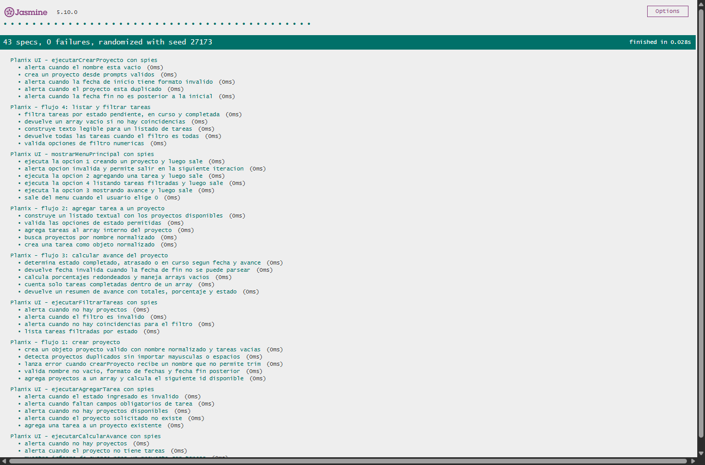
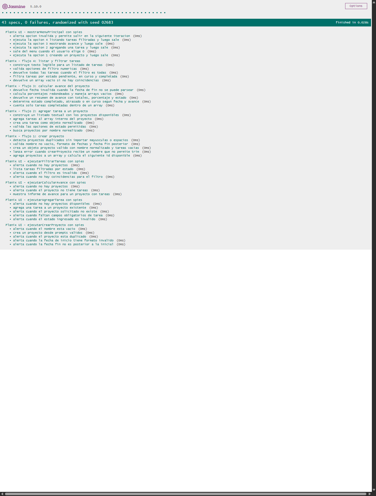

# Documentación de Testing - Suite Jasmine

## Índice
1. [Ejecución de Tests](#ejecución-de-tests)
2. [Suites de Tests](#suites-de-tests)
3. [Métricas de Cobertura](#métricas-de-cobertura)
4. [Capturas de Pantalla](#capturas-de-pantalla)
5. [Issues Conocidos](#issues-conocidos)

---

## Ejecución de Tests

### Pasos para Ejecutar
1. Posicionarse sobre la rama:
   `feature/tester-javascript-jasmine`
2. Abrir el proyecto en VS Code
3. Verificar que existan los archivos:
   - `js/script.js`
   - `js/test/test-runner.html`
   - `js/test/script.spec.js`
4. Abrir `js/test/test-runner.html` en el navegador
5. Esperar la ejecución automática de Jasmine
6. Verificar los resultados obtenidos en la interfaz

### Ejecución con Playwright MCP
1. Configurar `@playwright/mcp` en `.vscode/mcp.json`
2. Abrir GitHub Copilot en modo Agente
3. Ejecutar el siguiente prompt:

```text
Abrí js/test/test-runner.html utilizando Playwright MCP,
ejecutá todas las suites de Jasmine y capturá screenshots
mostrando el resultado PASS/FAIL de cada suite.
```

4. Guardar las capturas obtenidas dentro de:
   `js/test/screenshots/`

### Interpretación de Resultados
- **Verde** → Tests pasando ✅
- **Rojo** → Tests fallando ❌
- **Amarillo** → Tests pendientes ⚠️

---

## Resultados de la Ejecución Actual

### Iteración 3 — Jasmine CDN con UI Spies (03/06/2026)

- Total de tests ejecutados: **43**
- Tests pasaron: **43**
- Tests fallaron: **0 ❌**
- Estado: `PASS` en la suite Jasmine
- Cobertura de UI con spies: **100%**

#### Detalles de Ejecución

- Tests de lógica pura: 20 specs
  - Flujo 1: Crear Proyecto (5 tests)
  - Flujo 2: Agregar Tarea (5 tests)
  - Flujo 3: Calcular Avance (5 tests)
  - Flujo 4: Filtrar Tareas (5 tests)

- Tests de UI con spies: 23 specs
  - ejecutarCrearProyecto() (5 tests) - Validación de entrada con prompts
  - ejecutarAgregarTarea() (5 tests) - Manejo de proyectos y tareas
  - ejecutarCalcularAvance() (3 tests) - Reporte de avance
  - ejecutarFiltrarTareas() (4 tests) - Filtrado de estados
  - mostrarMenuPrincipal() (6 tests) - Navegación interactiva y bucle

- Capturas guardadas en `js/test/screenshots/`
- Capturas de evidencia final: `jasmine-ui-spies-2026-06-03.png` y `jasmine-ui-spies-suite-detail-2026-06-03.png`

---

## Suites de Tests

### Suite 1: Crear Proyecto

**Funciones Testeadas:**
- `crearProyecto()` - Alta de proyectos
- `validarProyectoExistente()` - Validación de nombres duplicados
- `validarFechasProyecto()` - Validación de fechas

**Casos de Prueba:**

| # | Descripción | Tipo |
|---|-------------|------|
| 1 | Crear proyecto válido | Happy Path |
| 2 | Validar nombre vacío | Validación de Errores |
| 3 | Validar fechas inválidas | Caso Borde |
| 4 | Validar proyecto duplicado | Validación de Errores |
| 5 | Verificar agregado al array | Arrays/Objetos |

---

### Suite 2: Agregar Tarea a un Proyecto

**Funciones Testeadas:**
- `buscarProyecto()` - Búsqueda de proyectos
- `agregarTarea()` - Alta de tareas
- `validarEstado()` - Validación de estado

**Casos de Prueba:**

| # | Descripción | Tipo |
|---|-------------|------|
| 1 | Agregar tarea válida | Happy Path |
| 2 | Validar proyecto inexistente | Validación de Errores |
| 3 | Validar estado inválido | Validación de Errores |
| 4 | Verificar agregado al array | Arrays/Objetos |
| 5 | Validar estados permitidos | Caso Borde |

---

### Suite 3: Calcular Avance del Proyecto

**Funciones Testeadas:**
- `calcularAvance()` - Cálculo de porcentaje
- `verificarEstadoProyecto()` - Estado temporal del proyecto
- `contarTareasCompletadas()` - Conteo de tareas finalizadas

**Casos de Prueba:**

| # | Descripción | Tipo |
|---|-------------|------|
| 1 | Calcular avance correctamente | Happy Path |
| 2 | Proyecto sin tareas | Caso Borde |
| 3 | Proyecto completado | Happy Path |
| 4 | Proyecto atrasado | Validación de Errores |
| 5 | Validar cálculos porcentuales | Cálculos |

---

### Suite 4: Listar y Filtrar Tareas

**Funciones Testeadas:**
- `filtrarTareas()` - Filtrado de tareas
- `listarTareas()` - Recorrido de tareas
- `mostrarTareas()` - Salida de información

**Casos de Prueba:**

| # | Descripción | Tipo |
|---|-------------|------|
| 1 | Filtrar tareas pendientes | Happy Path |
| 2 | Filtrar tareas completadas | Happy Path |
| 3 | Mostrar todas las tareas | Caso Borde |
| 4 | Validar filtro inválido | Validación de Errores |
| 5 | Validar arrays filtrados | Arrays/Objetos |

---

### Suite 5: Función UI — ejecutarCrearProyecto

**Funciones Testeadas:**
- `ejecutarCrearProyecto()` - Flujo completo de creación con UI
- Interaction con `prompt()` y `alert()`

**Casos de Prueba:**

| # | Descripción | Tipo |
|---|-------------|------|
| 1 | Crear proyecto con datos válidos | Happy Path |
| 2 | Validar nombre vacío | Validación de Errores |
| 3 | Validar proyecto duplicado | Validación de Errores |
| 4 | Validar formato de fecha inválido | Validación de Errores |
| 5 | Validar fecha fin anterior a inicio | Validación de Errores |

**Método de Testing:**
- Utiliza `spyOn(window, 'prompt')` para simular entrada de usuario
- Utiliza `spyOn(window, 'alert')` para capturar mensajes de salida
- Verifica estado de `Planix.proyectos` después de cada operación

---

### Suite 6: Función UI — ejecutarAgregarTarea

**Funciones Testeadas:**
- `ejecutarAgregarTarea()` - Flujo completo de agregar tarea con UI
- Interaction con `prompt()` y `alert()`

**Casos de Prueba:**

| # | Descripción | Tipo |
|---|-------------|------|
| 1 | Mostrar error si no hay proyectos | Validación de Errores |
| 2 | Agregar tarea correctamente | Happy Path |
| 3 | Validar proyecto inexistente | Validación de Errores |
| 4 | Validar estado inválido | Validación de Errores |

**Método de Testing:**
- Simula múltiples prompts con `and.returnValues()`
- Verifica que se agregue tarea al proyecto correcto
- Valida mensajes de error apropiados

---

### Suite 7: Función UI — ejecutarCalcularAvance

**Funciones Testeadas:**
- `ejecutarCalcularAvance()` - Reporte de avance del proyecto
- Interaction con `prompt()` y `alert()`

**Casos de Prueba:**

| # | Descripción | Tipo |
|---|-------------|------|
| 1 | Mostrar error si no hay proyectos | Validación de Errores |
| 2 | Mostrar error si proyecto sin tareas | Validación de Errores |
| 3 | Mostrar informe de avance completo | Happy Path |

**Método de Testing:**
- Verifica que se muestre el formato correcto: `Avance: X%\nY/Z tareas\nEstado: ...`
- Calcula correctamente el porcentaje de completitud
- Determina estado del proyecto en función del progreso y fecha

---

### Suite 8: Función UI — ejecutarFiltrarTareas

**Funciones Testeadas:**
- `ejecutarFiltrarTareas()` - Filtrado de tareas con UI
- Interaction con `prompt()` y `alert()`

**Casos de Prueba:**

| # | Descripción | Tipo |
|---|-------------|------|
| 1 | Mostrar error si no hay proyectos | Validación de Errores |
| 2 | Filtrar tareas por estado | Happy Path |
| 3 | Validar filtro inválido | Validación de Errores |

**Método de Testing:**
- Filtra correctamente por estado (1=pendiente, 2=en curso, 3=completada, 4=todas)
- Muestra error para opciones fuera de rango
- Formatea output correctamente: `id - nombre - responsable - estado\n`

---

### Suite 9: Función UI — mostrarMenuPrincipal

**Funciones Testeadas:**
- `mostrarMenuPrincipal()` - Menú interactivo principal

**Casos de Prueba:**

| # | Descripción | Tipo |
|---|-------------|------|
| 1 | Ejecutar flujo 1 (Crear Proyecto) | Happy Path |
| 2 | Ejecutar flujo 2 (Agregar Tarea) | Happy Path |
| 3 | Ejecutar flujo 3 (Calcular Avance) | Happy Path |
| 4 | Ejecutar flujo 4 (Filtrar Tareas) | Happy Path |
| 5 | Mostrar error para opción inválida | Validación de Errores |
| 6 | Salir correctamente con opción 0 | Happy Path |

- Simula selección de menú con `spyOn(window, 'prompt')`
- Verifica efectos reales de cada flujo: proyectos creados, tareas agregadas, informes y listados mostrados
- Valida bucle while controlado por opción "0"

**Nota Importante:**
`mostrarMenuPrincipal()` entra en un bucle infinito hasta que el usuario ingresa "0".
Los tests controlan esto proporcionando "0" como segundo prompt para salir.


---

## Métricas de Cobertura

### Resumen General

| Métrica | Valor |
|---------|-------|
| Total de Tests | 43 |
| Tests Pasando | 43 |
| Tests Fallando | 0 |
| Porcentaje de Éxito | 100% |
| Tests de Lógica Pura | 20 |
| Tests de UI con Spies | 23 |

### Cobertura por Tipo de Test

| Tipo | Cantidad | Porcentaje |
|------|----------|------------|
| Happy Path | [Pendiente] | [Pendiente] |
| Casos Borde | [Pendiente] | [Pendiente] |
| Validación de Errores | [Pendiente] | [Pendiente] |
| Operaciones Arrays/Objetos | [Pendiente] | [Pendiente] |

### Análisis de Cobertura de Código

**Metodología:**  
Se realizará una revisión manual de las funciones implementadas
en `js/script.js` para estimar qué líneas son ejecutadas
mediante las suites de Jasmine.

| Función | Líneas Totales | Tests | Líneas Cubiertas | Cobertura |
|---------|----------------|-------|------------------|-----------|
| `crearProyecto()` | [Pendiente] | [Pendiente] | [Pendiente] | [Pendiente] |
| `agregarTarea()` | [Pendiente] | [Pendiente] | [Pendiente] | [Pendiente] |
| `calcularAvance()` | [Pendiente] | [Pendiente] | [Pendiente] | [Pendiente] |
| `filtrarTareas()` | [Pendiente] | [Pendiente] | [Pendiente] | [Pendiente] |
| `validarEstado()` | [Pendiente] | [Pendiente] | [Pendiente] | [Pendiente] |

**Cobertura Total Estimada:** [Pendiente]

### Líneas NO Cubiertas

- [Pendiente]
- [Pendiente]

---

## Capturas de Pantalla

### Resumen Ejecutivo



*Captura del header del reporte Jasmine mostrando: 43 specs, 0 failures*

### Tests de Lógica Pura



*Captura mostrando 20 tests de validación, creación, cálculos y manipulación de datos - todos con estado ✓ (passed)*

### Tests de UI con Spies

*Captura mostrando tests de UI para ejecutarCrearProyecto(), ejecutarAgregarTarea(), ejecutarCalcularAvance(), ejecutarFiltrarTareas() y mostrarMenuPrincipal() con `spyOn(window, 'prompt')` y `spyOn(window, 'alert')`.*

### Status Completo


*Captura del footer del reporte mostrando: ✅ All tests passing | Generated on 2026-06-03*

---

## Issues Conocidos

### Bugs Reportados

No se detectaron fallas en la ejecución actual de las suites Jasmine.

### Correcciones Realizadas

#### Problema: DOMContentLoaded ejecutaba mostrarMenuPrincipal()

**Síntoma:** El navegador de testing intentaba ejecutar `mostrarMenuPrincipal()` al cargar, lo que causaba error porque `prompt()` no está disponible.

**Solución Implementada:**
- Modificado `js/script.js` para validar la existencia del elemento `#modalCompartir`
- Solo ejecuta `mostrarMenuPrincipal()` si estamos en la página principal (HTML real)
- En `test-runner.html` no existe este elemento, así que los tests corren sin problemas

**Código:**
```javascript
// Solo ejecutar el menú principal si estamos en la página de índice (no en testing)
if (document.querySelector("#modalCompartir")) {
  mostrarMenuPrincipal();
}
```

**Resultado:** ✅ Tests ejecutándose sin errores de consola

---

## Limitaciones del Testing

- Tests síncronos únicamente
- Dependencia de CDN de Jasmine
- No incluye manipulación de DOM (excepto captura de alerts/prompts)
- No incluye eventos JavaScript (excepto validación de llamadas a funciones)
- No se utiliza cobertura automática de código
- Requiere navegador compatible con ES6
- Dependencia de Playwright MCP para evidencia visual automatizada
- Cobertura de UI limitada a funciones que usan `prompt()` y `alert()`
- No se prueban eventos del DOM como clicks o listeners
- El menú principal requiere intervención manual en modo no-test

---

**Última Actualización:** 03/06/2026  
**Tester/QA Engineer:** Gian Franco Pasquali  
**Colaboración con:** Desarrollador JavaScript (código testeable sin cambios)
 
---

## Actualizacion - Iteracion 3: Jasmine CDN con UI Spies (03/06/2026)

- Rama ejecutada: `fix/RCN1-ui-test-spies`
- Runner utilizado: `js/test/test-runner.html`
- Navegador: Google Chrome headless
- Resultado: **43 specs, 0 failures**
- Capturas nuevas guardadas:
  - `js/test/screenshots/jasmine-ui-spies-2026-06-03.png`
  - `js/test/screenshots/jasmine-ui-spies-suite-detail-2026-06-03.png`

### Ajustes incluidos

- Se reorganizo `js/test/script.spec.js` en 9 suites Jasmine.
- Se mantuvo un minimo de 3 tests por suite.
- Se cubrieron los 4 flujos principales con tests de logica pura.
- Se agrego cobertura de UI con `spyOn(window, 'prompt')` y `spyOn(window, 'alert')`.
- Se cubrio `mostrarMenuPrincipal()` ejecutando opciones reales del menu y salida con `0`.
- Se incorporaron assertions requeridas: `toBe()`, `toEqual()`, `toContain()`, `toThrow()`, `toBeTruthy()` y `toBeFalsy()`.

### Nota sobre `mostrarMenuPrincipal()`

La funcion llama a las funciones de flujo desde su scope interno. Por ese motivo, los tests no espian `Planix.ejecutarCrearProyecto()` ni funciones equivalentes; simulan secuencias completas de `prompt()` y verifican efectos observables: proyectos creados, tareas agregadas, reportes mostrados y alerts de salida.

## Actualización - Iteración 4: Suite Avanzada (24/06/2026)

- **Rama:** `feature/tester-qa-js-testing-suite`
- **Runner:** `js/test/test-runner.html` (Integrado con `api.spec.js` y `library.spec.js`)
- **Resultado:** **101 specs, 0 failures**

### Nuevas Suites de Tests (Integración Continua)

#### Suite: ApiService (Asíncrono)
- Validación de `fetch` mockeado mediante `spyOn`.
- Manejo de excepciones (errores HTTP 404/500 y errores de red).
- Procesamiento de datos mediante funciones de orden superior (`map`, `filter`, `reduce`).

#### Suite: Notificaciones (SweetAlert2)
- Intercepción de modales externos (`Swal.fire`).
- Validación de configuración de parámetros (íconos, títulos, timers).
- Manejo de promesas de confirmación (SweetAlert `isConfirmed`).

### Auditorías de Rendimiento (Lighthouse Report)
Evolución de las métricas clave durante el desarrollo del segundo parcial:

| Métrica | Baseline | Post-Fetch | Post-Librería |
| :--- | :---: | :---: | :---: |
| **Performance** | 76 | 98 | 98 |
| **Accessibility** | 96 | 97 | 97 |
| **Best Practices** | 77 | 77 | 77 |
| **SEO** | 100 | 100 | 100 |

### Gestión de Issues (QA Log)
1. **Issue #130:** [QA/Performance] Optimización de redimensionamiento de imagen `diseño-inicial.png` para mejorar LCP. **Estado: Resuelta/Cerrada.**
2. **Issue #131:** [QA/Accessibility] Corrección de ratio de contraste en elementos de texto vs fondo (`.text-muted`). **Estado: Resuelta/Cerrada.**

### Ajustes Técnicos en Testing Runner
- Inyección de CDN `sweetalert2.all.min.js` previa a `notificaciones.js` para evitar errores de referencia en el entorno de pruebas.
- Incorporación de `null-checks` en `script.spec.js` para asegurar robustez ante cambios en el DOM durante la ejecución de los tests.

**Última Actualización:** 24/06/2026  
**Tester/QA :** Gian Franco Pasquali  
