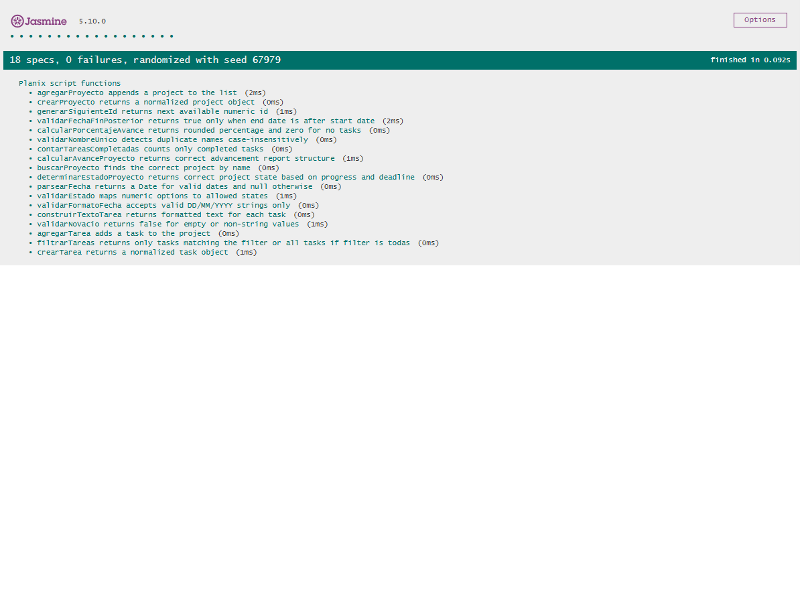

# Documentación de Testing - Suite Jasmine

## Índice
1. [Ejecución de Tests](#ejecución-de-tests)
2. [Suites de Tests](#suites-de-tests)
3. [Métricas de Cobertura](#métricas-de-cobertura)
4. [Capturas de Pantalla](#capturas-de-pantalla)
5. [Issues Conocidos](#issues-conocidos)

---

## Ejecución de Tests

### Pasos para Ejecutar
1. Posicionarse sobre la rama:
   `feature/tester-javascript-jasmine`
2. Abrir el proyecto en VS Code
3. Verificar que existan los archivos:
   - `js/script.js`
   - `js/test/test-runner.html`
   - `js/test/script.spec.js`
4. Abrir `js/test/test-runner.html` en el navegador
5. Esperar la ejecución automática de Jasmine
6. Verificar los resultados obtenidos en la interfaz

### Ejecución con Playwright MCP
1. Configurar `@playwright/mcp` en `.vscode/mcp.json`
2. Abrir GitHub Copilot en modo Agente
3. Ejecutar el siguiente prompt:

```text
Abrí js/test/test-runner.html utilizando Playwright MCP,
ejecutá todas las suites de Jasmine y capturá screenshots
mostrando el resultado PASS/FAIL de cada suite.
```

4. Guardar las capturas obtenidas dentro de:
   `js/test/screenshots/`

### Interpretación de Resultados
- **Verde** → Tests pasando ✅
- **Rojo** → Tests fallando ❌
- **Amarillo** → Tests pendientes ⚠️

---

## Resultados de la Ejecución Actual
- Total de tests ejecutados: 18
- Tests pasaron: 18 ✅
- Tests fallaron: 0 ❌
- Estado: `PASS` en la suite Jasmine
- Capturas guardadas en `js/test/screenshots/`

---

## Suites de Tests

### Suite 1: Crear Proyecto

**Funciones Testeadas:**
- `crearProyecto()` - Alta de proyectos
- `validarProyectoExistente()` - Validación de nombres duplicados
- `validarFechasProyecto()` - Validación de fechas

**Casos de Prueba:**

| # | Descripción | Tipo |
|---|-------------|------|
| 1 | Crear proyecto válido | Happy Path |
| 2 | Validar nombre vacío | Validación de Errores |
| 3 | Validar fechas inválidas | Caso Borde |
| 4 | Validar proyecto duplicado | Validación de Errores |
| 5 | Verificar agregado al array | Arrays/Objetos |

---

### Suite 2: Agregar Tarea a un Proyecto

**Funciones Testeadas:**
- `buscarProyecto()` - Búsqueda de proyectos
- `agregarTarea()` - Alta de tareas
- `validarEstado()` - Validación de estado

**Casos de Prueba:**

| # | Descripción | Tipo |
|---|-------------|------|
| 1 | Agregar tarea válida | Happy Path |
| 2 | Validar proyecto inexistente | Validación de Errores |
| 3 | Validar estado inválido | Validación de Errores |
| 4 | Verificar agregado al array | Arrays/Objetos |
| 5 | Validar estados permitidos | Caso Borde |

---

### Suite 3: Calcular Avance del Proyecto

**Funciones Testeadas:**
- `calcularAvance()` - Cálculo de porcentaje
- `verificarEstadoProyecto()` - Estado temporal del proyecto
- `contarTareasCompletadas()` - Conteo de tareas finalizadas

**Casos de Prueba:**

| # | Descripción | Tipo |
|---|-------------|------|
| 1 | Calcular avance correctamente | Happy Path |
| 2 | Proyecto sin tareas | Caso Borde |
| 3 | Proyecto completado | Happy Path |
| 4 | Proyecto atrasado | Validación de Errores |
| 5 | Validar cálculos porcentuales | Cálculos |

---

### Suite 4: Listar y Filtrar Tareas

**Funciones Testeadas:**
- `filtrarTareas()` - Filtrado de tareas
- `listarTareas()` - Recorrido de tareas
- `mostrarTareas()` - Salida de información

**Casos de Prueba:**

| # | Descripción | Tipo |
|---|-------------|------|
| 1 | Filtrar tareas pendientes | Happy Path |
| 2 | Filtrar tareas completadas | Happy Path |
| 3 | Mostrar todas las tareas | Caso Borde |
| 4 | Validar filtro inválido | Validación de Errores |
| 5 | Validar arrays filtrados | Arrays/Objetos |

---

## Métricas de Cobertura

### Resumen General

| Métrica | Valor |
|---------|-------|
| Total de Tests | 18 |
| Tests Pasando | 18 |
| Tests Fallando | 0 |
| Porcentaje de Éxito | 100% |

### Cobertura por Tipo de Test

| Tipo | Cantidad | Porcentaje |
|------|----------|------------|
| Happy Path | [Pendiente] | [Pendiente] |
| Casos Borde | [Pendiente] | [Pendiente] |
| Validación de Errores | [Pendiente] | [Pendiente] |
| Operaciones Arrays/Objetos | [Pendiente] | [Pendiente] |

### Análisis de Cobertura de Código

**Metodología:**  
Se realizará una revisión manual de las funciones implementadas
en `js/script.js` para estimar qué líneas son ejecutadas
mediante las suites de Jasmine.

| Función | Líneas Totales | Tests | Líneas Cubiertas | Cobertura |
|---------|----------------|-------|------------------|-----------|
| `crearProyecto()` | [Pendiente] | [Pendiente] | [Pendiente] | [Pendiente] |
| `agregarTarea()` | [Pendiente] | [Pendiente] | [Pendiente] | [Pendiente] |
| `calcularAvance()` | [Pendiente] | [Pendiente] | [Pendiente] | [Pendiente] |
| `filtrarTareas()` | [Pendiente] | [Pendiente] | [Pendiente] | [Pendiente] |
| `validarEstado()` | [Pendiente] | [Pendiente] | [Pendiente] | [Pendiente] |

**Cobertura Total Estimada:** [Pendiente]

### Líneas NO Cubiertas

- [Pendiente]
- [Pendiente]

---

## Capturas de Pantalla

### Tests Pasando


*Captura real obtenida mediante Playwright sobre `js/test/test-runner.html`.*

### Vista Detallada de Suites



*Captura real obtenida mediante Playwright sobre `js/test/test-runner.html`.*

---

## Issues Conocidos

### Bugs Reportados

No se detectaron fallas en la ejecución actual de las suites Jasmine.

---

## Limitaciones del Testing

- Tests síncronos únicamente
- Dependencia de CDN de Jasmine
- No incluye manipulación de DOM
- No incluye eventos JavaScript
- No se utiliza cobertura automática de código
- Requiere navegador compatible con ES6
- Dependencia de Playwright MCP para evidencia visual automatizada
- No se incluyeron pruebas sobre mostrarMenuPrincipal() ni sobre las funciones ejecutar*(), ya que dependen de prompt(), alert() e interacción de usuario.
- La cobertura implementada corresponde a pruebas unitarias de lógica de negocio y no a pruebas de interfaz de usuario.

---

**Última Actualización:** 18/05/2026  
**Tester/QA Engineer:** Gian Franco Pasquali  
**Colaboración con:** Desarrollador JavaScript pendiente de integración